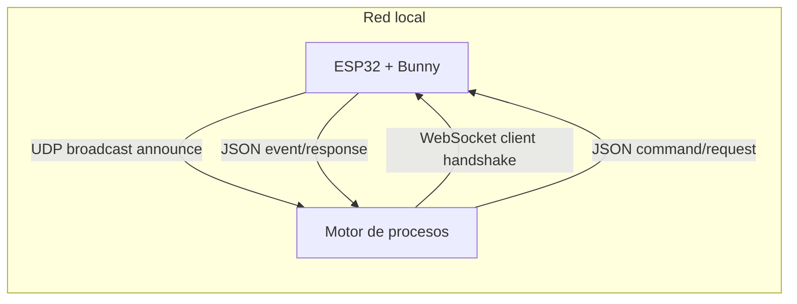
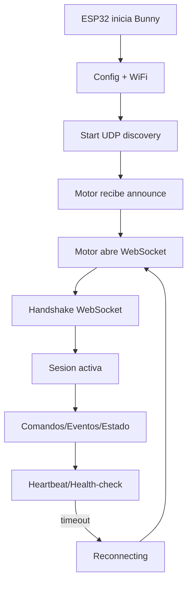
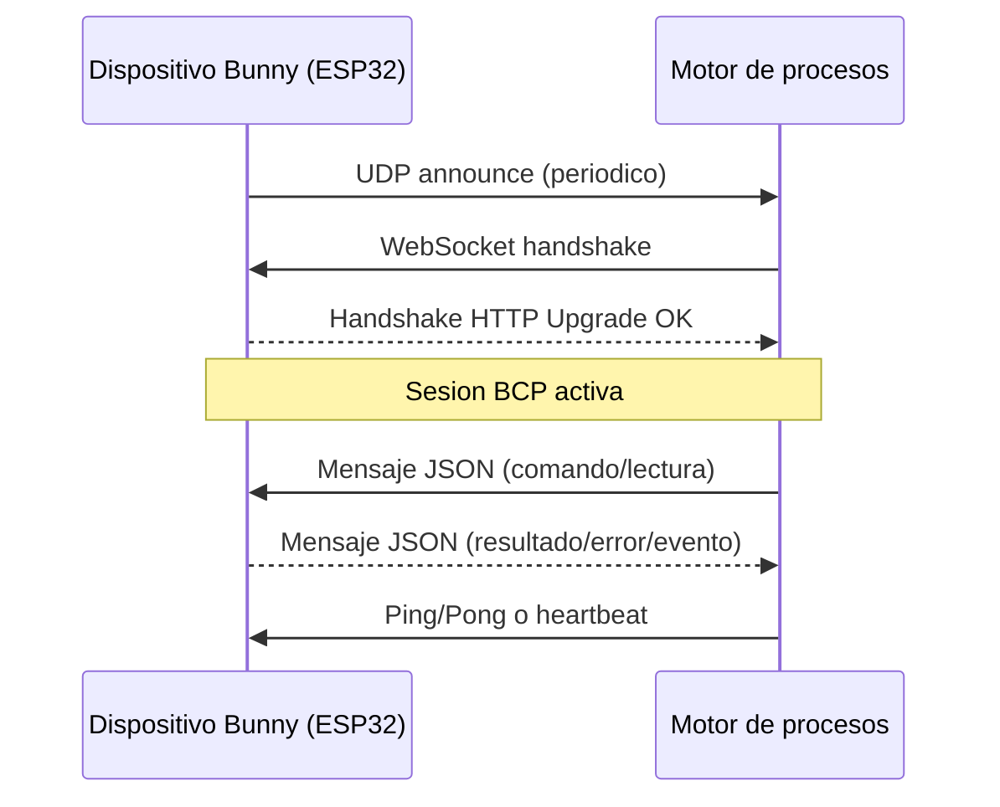
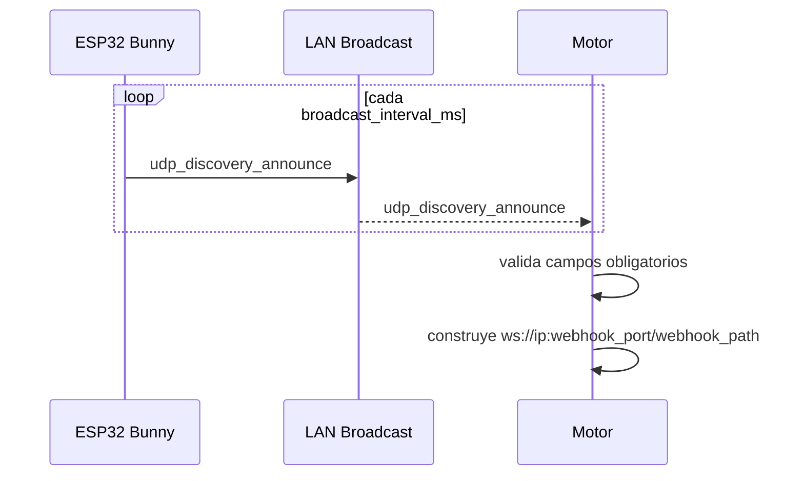
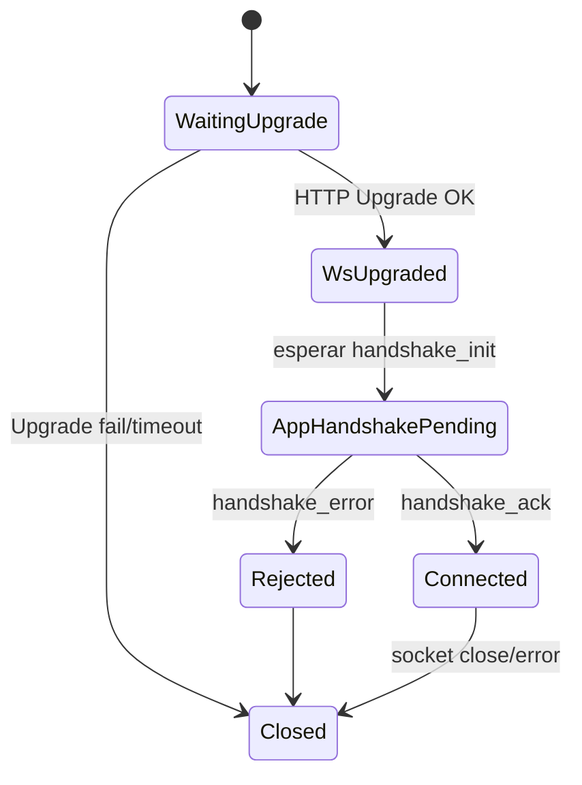
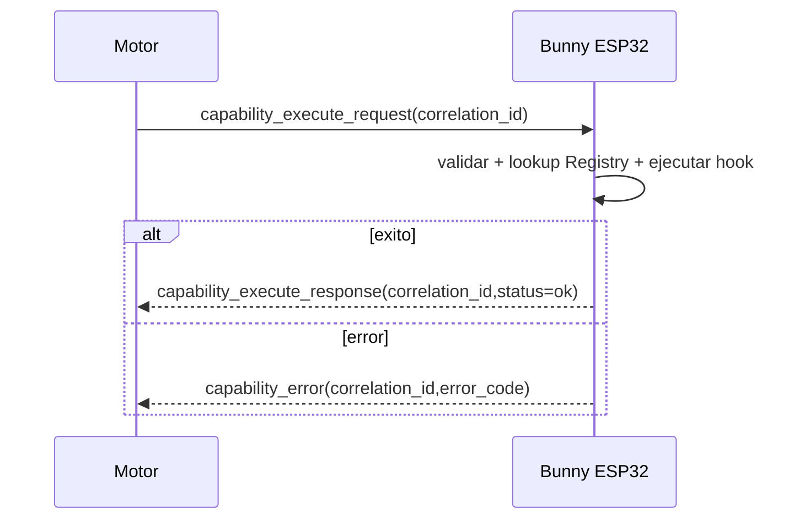
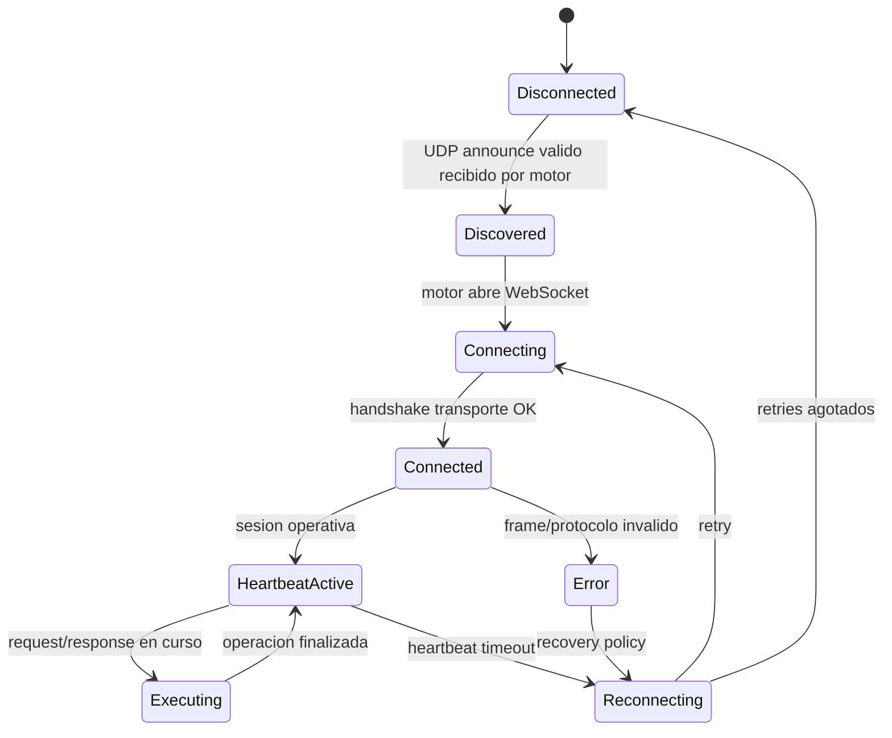

# BCP - Especificacion del Bunny Communication Protocol

Estado: Draft oficial del framework

Version del documento: 0.1.0

Fecha: 28 de abril de 2026

Alcance de implementacion auditado contra codigo fuente en `components/bunny` y `main`.

## Indice de navegacion

- [Convenciones normativas](#convenciones-normativas)
- [1. Introduccion](#1-introduccion)
- [2. Arquitectura General](#2-arquitectura-general)
- [3. Protocolo de Descubrimiento por UDP Broadcast](#3-protocolo-de-descubrimiento-por-udp-broadcast)
- [4. Handshake de Conexion WebSocket](#4-handshake-de-conexion-websocket)
- [5. Protocolo de Persistencia (Heartbeat)](#5-protocolo-de-persistencia-heartbeat)
- [6. Protocolo de Ejecucion de Capacidades](#6-protocolo-de-ejecucion-de-capacidades)
- [7. Protocolo de Reporte de Eventos](#7-protocolo-de-reporte-de-eventos)
- [8. Reglas de Validacion JSON](#8-reglas-de-validacion-json)
- [9. Maquina de Estados de BCP](#9-maquina-de-estados-de-bcp)
- [10. Versionado del Protocolo](#10-versionado-del-protocolo)
- [11. Cobertura e Implementaciones Faltantes](#11-cobertura-e-implementaciones-faltantes)
- [12. Apendices](#12-apendices)

## Convenciones normativas

Las palabras clave MUST, SHOULD y MAY se interpretan como requisitos normativos:

- MUST: obligatorio para conformidad BCP.
- SHOULD: recomendado; puede omitirse con justificacion tecnica.
- MAY: opcional.

Cuando un requisito no esta implementado en el framework actual, se marca como:

- [NO IMPLEMENTADO]
- [PENDIENTE DE DEFINIR]

## 1. Introduccion

### 1.1 Que es BCP

BCP (Bunny Communication Protocol) es el conjunto de protocolos de descubrimiento, establecimiento de sesion, mantenimiento de sesion y transporte de mensajes entre:

- Emisor/Receptor A: microcontrolador con Bunny Framework (ESP32).
- Emisor/Receptor B: motor de procesos.

BCP define contrato de interoperabilidad, no logica de negocio.

### 1.2 Alcance

BCP cubre cinco capas:

- Discovery Layer: define como el ESP32 anuncia su presencia en red local, que campos MUST incluir el anuncio y como el motor interpreta esos anuncios para construir un endpoint de sesion.
- Connection Layer: define el establecimiento de sesion WebSocket, la condicion minima para considerar la sesion activa y la separacion entre handshake de transporte y handshake de aplicacion.
- Persistence Layer: define liveness de sesion (heartbeat/health-check), tiempos esperados, condicion de timeout y transicion obligatoria a reconexion cuando la sesion deja de ser confiable.
- Capability Execution Layer: define el contrato request/response para ejecutar capacidades, incluyendo correlacion de mensajes, validacion de payload y reglas de error deterministas.
- Event Transport Layer: define la publicacion de eventos desde el dispositivo hacia el motor, confirmaciones de entrega, orden esperado y manejo de duplicados o desfases.

BCP no cubre:

- Reglas de negocio del motor.
- Modelo interno de procesos del motor.
- Politicas de autenticacion/autorizacion externas al canal (salvo marcarlas como pendientes en esta version).

Interpretacion obligatoria del alcance:

- Si un comportamiento pertenece al dominio de negocio (por ejemplo, "cuando encender ventilador"), ese comportamiento queda fuera de BCP.
- Si un comportamiento define interoperabilidad wire (por ejemplo, "que campos debe traer el mensaje"), ese comportamiento cae dentro de BCP y MUST documentarse explicitamente.

### 1.3 Objetivos

- Interoperabilidad: un motor tercero debe poder descubrir y conectar dispositivos Bunny.
- Extensibilidad: agregar tipos de mensajes sin romper clientes existentes.
- Tolerancia a fallos: detectar perdida de sesion y reconectar.
- Compatibilidad entre motores: mantener contrato comun con versionado explicito.

Desambiguacion de objetivos para implementacion:

- Interoperabilidad significa que dos implementaciones independientes (un ESP32 con Bunny y un motor desarrollado por tercero) pueden completar el flujo `discovery -> websocket -> intercambio de mensajes` sin conocer detalles internos entre si. En terminos de conformidad, un motor es interoperable si interpreta correctamente `udp_discovery_announce`, construye una URL valida y completa handshake de sesion.
- Extensibilidad significa que los mensajes nuevos deben agregarse como nuevos `type` o como campos opcionales compatibles, evitando romper parseo de versiones previas. Una extension no es valida si obliga a reescribir clientes existentes para operaciones ya soportadas.
- Tolerancia a fallos significa que la sesion no se considera binaria (viva/muerta) sin transicion controlada: debe existir deteccion de degradacion, timeout y politica de reconexion. El objetivo no es "evitar fallas", sino garantizar recuperacion determinista despues de fallar.
- Compatibilidad entre motores significa que el contrato BCP debe ser suficiente para que distintos motores (no solo uno) puedan operar con el mismo firmware. Esto exige versionado de protocolo, semantica estable por mensaje y reglas de error consistentes.

Criterios de exito de alto nivel:

- Un integrador externo SHOULD poder implementar un cliente BCP sin inspeccionar el codigo fuente del firmware.
- Una auditoria tecnica SHOULD poder mapear cada mensaje documentado a evidencia de implementacion o a estado `[NO IMPLEMENTADO]`.
- Toda diferencia entre contrato deseado y estado actual MUST quedar explicitamente marcada en este documento.

### 1.4 Invariantes globales BCP

- Un motor MUST completar handshake de conexion antes de enviar mensajes de ejecucion de capacidades.
- Todo mensaje de ejecucion MUST incluir `correlation_id`. [NO IMPLEMENTADO EN PARSEO DE DISPOSITIVO]
- Si el heartbeat vence, el estado de sesion MUST transicionar a `Reconnecting`. [NO IMPLEMENTADO EN MAQUINA DE ESTADOS DE CODIGO]
- El anuncio UDP MUST incluir endpoint WebSocket (`ip`, `webhook_port`, `webhook_path`) para habilitar conexion.
- El ESP32 MUST aceptar frames WebSocket de texto en el path configurado.

### 1.5 Como leer esta especificacion

Este documento se usa en tres modos distintos y cada modo requiere una lectura diferente:

- Implementacion de motor: priorizar secciones 3, 4, 5, 6 y 7 para construir parser, state machine y politicas de reconexion.
- Auditoria de conformidad: priorizar secciones 8, 9, 10 y 11 para identificar brechas entre contrato y codigo actual.
- Diseno evolutivo de protocolo: priorizar secciones 1, 10 y 12 para extender BCP sin romper compatibilidad.

Regla de interpretacion para lectores:

- Si una regla esta marcada con MUST y no tiene etiqueta `[NO IMPLEMENTADO]`, se considera requisito operativo actual.
- Si una regla esta marcada como `[NO IMPLEMENTADO]`, se considera contrato objetivo, no comportamiento disponible en runtime.

## 2. Arquitectura General

### 2.1 Componentes

- Bunny Framework (ESP32): emite discovery UDP, expone servidor WebSocket, registra capacidades.
- Motor de procesos: escucha UDP, construye URL WebSocket, inicia handshake y sesion.
- WebSocket transport: canal bidireccional de texto JSON.
- UDP discovery: anuncio periodico sin estado para presencia de dispositivo.

### 2.2 Diagrama de arquitectura



### 2.3 Diagrama de flujo general



### 2.4 Sequence diagram general



## 3. Protocolo de Descubrimiento por UDP Broadcast

Estado de implementacion: Implementado en emision del lado ESP32.

Fuente principal:

- `components/bunny/network/discovery.c`
- `components/bunny/network/discovery.h`
- `components/bunny/config/config.h`

### 3.1 Proposito

Permitir que el motor de procesos detecte dispositivos Bunny sin configuracion manual de IP.

### 3.2 Precondiciones

- El ESP32 MUST tener configuracion cargada (`bunny_config_get`).
- `discovery.enabled` MUST ser `true` para emitir anuncios.
- El socket UDP MUST crearse con `SO_BROADCAST` habilitado.

### 3.3 Flujo paso a paso

1. ESP32 inicia tarea `discovery_task`.
2. ESP32 resuelve IP local (si falla usa `0.0.0.0`).
3. ESP32 construye payload JSON de anuncio.
4. ESP32 envia UDP broadcast a `255.255.255.255:discovery.udp_port`.
5. ESP32 espera `broadcast_interval_ms`.
6. Repite mientras `s_started == true`.

### 3.4 Formato exacto del mensaje

Mensaje: `udp_discovery_announce`

Direccion: ESP32 -> Broadcast LAN

Transporte: UDP

Ejemplo de estructura wire:

```json
{
  "bunny": true,
  "id": "esp32-001",
  "name": "Mi Dispositivo Bunny",
  "version": "0.1.0",
  "ip": "192.168.1.50",
  "webhook_port": 8080,
  "webhook_path": "/bunny"
}
```

### 3.5 Campos obligatorios y opcionales

| Campo | Tipo | Requerido | Restricciones | Descripcion |
|---|---|---|---|---|
| bunny | boolean | Si | MUST ser `true` | Identificador de protocolo Bunny |
| id | string | Si | longitud > 0 | Identificador unico de dispositivo |
| name | string | Si | longitud > 0 | Nombre legible |
| version | string | Si | longitud > 0 | Version firmware/proyecto |
| ip | string | Si | IPv4 textual | IP reportada por ESP32 |
| webhook_port | integer | Si | 1..65535 | Puerto WebSocket del ESP32 |
| webhook_path | string | Si | MUST iniciar con `/` | Path de endpoint WebSocket |

### 3.6 Restricciones por campo

- `bunny` MUST ser booleano literal.
- `webhook_port` MUST ser entero decimal sin comillas.
- `webhook_path` SHOULD evitar espacios.
- `ip` MAY ser `0.0.0.0` si el ESP32 no obtuvo IP aun.

### 3.7 Validaciones

Validaciones implementadas por ESP32 al emitir:

- NO valida semantica de longitud ni formato de `id`, `name`, `version`, `webhook_path`; usa valores de configuracion.

Validaciones requeridas para motor receptor:

- MUST descartar anuncio si `bunny != true`.
- MUST descartar anuncio si falta `ip`, `webhook_port` o `webhook_path`.
- MUST validar rango de `webhook_port`.

### 3.8 Respuesta exitosa

UDP announce no tiene ACK de protocolo BCP.

Efecto esperado en motor:

- Motor MUST marcar el dispositivo como `Discovered` y construir URL WebSocket.

### 3.9 Respuestas de error

No existe mensaje de error en UDP discovery.

Errores observables en emisor ESP32:

- `Failed to create UDP socket`
- `Failed to enable UDP broadcast`
- `Failed building UDP payload`
- `UDP announce send failed`

### 3.10 Casos limite

- `ip = 0.0.0.0`: motor SHOULD posponer conexion hasta recibir IP valida.
- anuncios duplicados: motor MUST tratarlos como refresh de `last_seen`.
- reinicio de ESP32 con mismo `id`: motor MUST actualizar endpoint por ultimo anuncio.

### 3.11 Timeouts

- Intervalo de emision actual: `discovery.broadcast_interval_ms` (default 3000 ms).
- Timeout de stale en motor: [PENDIENTE DE DEFINIR].

### 3.12 Reintentos

- Emisor ESP32 reintenta automaticamente por diseño de bucle periodico.
- Politica de reintento de parseo/descubrimiento en motor: [PENDIENTE DE DEFINIR].

### 3.13 Reconexion

- El motor SHOULD usar anuncio actualizado para reconectar WebSocket si cambia IP/puerto/path.

### 3.14 Seguridad

- Discovery UDP no incluye autenticacion ni firma de mensaje. [NO IMPLEMENTADO]
- Integridad del anuncio: [PENDIENTE DE DEFINIR].

### 3.15 Estado de implementacion

- Emision UDP periodica: Implementado.
- Recepcion/validacion formal en motor: fuera de este repositorio.
- Integridad/autenticidad de anuncio: [NO IMPLEMENTADO].

#### JSON Schema: `udp_discovery_announce`

```json
{
  "$schema": "https://json-schema.org/draft/2020-12/schema",
  "$id": "bcp://schemas/udp_discovery_announce.json",
  "type": "object",
  "additionalProperties": false,
  "required": [
    "bunny",
    "id",
    "name",
    "version",
    "ip",
    "webhook_port",
    "webhook_path"
  ],
  "properties": {
    "bunny": { "const": true },
    "id": { "type": "string", "minLength": 1 },
    "name": { "type": "string", "minLength": 1 },
    "version": { "type": "string", "minLength": 1 },
    "ip": {
      "type": "string",
      "pattern": "^(?:[0-9]{1,3}\\.){3}[0-9]{1,3}$"
    },
    "webhook_port": { "type": "integer", "minimum": 1, "maximum": 65535 },
    "webhook_path": { "type": "string", "pattern": "^/.+" }
  }
}
```

Ejemplo valido:

```json
{
  "bunny": true,
  "id": "esp32-001",
  "name": "Nodo sala",
  "version": "0.1.0",
  "ip": "192.168.1.50",
  "webhook_port": 8080,
  "webhook_path": "/bunny"
}
```

Ejemplo invalido:

```json
{
  "bunny": "true",
  "id": "",
  "name": "Nodo sala",
  "version": "0.1.0",
  "ip": "not-an-ip",
  "webhook_port": "8080",
  "webhook_path": "bunny"
}
```

Explicacion semantica:

- Mensaje valido indica presencia de dispositivo y endpoint de sesion.
- Mensaje invalido debe ser descartado por el motor para evitar conexiones a endpoints ambiguos.

### 3.16 Sequence diagram



### 3.17 Guia de interpretacion detallada por punto

- 3.1 Proposito: el emisor del mensaje es el ESP32 y el receptor inicial es cualquier host de la subred. El objetivo operativo no es "conectar" sino "publicar suficiente informacion para que el motor pueda decidir conectarse".
- 3.2 Precondiciones: si `discovery.enabled=false`, el ESP32 no enviara anuncios y el motor no podra descubrir por broadcast; en ese escenario, el motor solo podria conectar por configuracion estatica externa a BCP.
- 3.3 Flujo: cada iteracion produce un snapshot de disponibilidad de endpoint. No existe sesion ni historial en UDP; cada anuncio debe ser auto-contenido.
- 3.4 Formato: el payload define identidad (`id`, `name`, `version`) y conectividad (`ip`, `webhook_port`, `webhook_path`) en un mismo mensaje para evitar consultas adicionales.
- 3.5 Campos: todos los campos listados son obligatorios porque el motor necesita resolver tanto "quien es" como "donde conectar" en una sola recepcion.
- 3.6 Restricciones: las restricciones minimas evitan ambiguedad de parseo; por ejemplo, `webhook_port` como string puede romper motores que esperan entero y MUST tratarse como invalido.
- 3.7 Validaciones: el ESP32 hoy no endurece el contenido porque usa configuracion local; por eso, la carga de robustez recae en el motor, que MUST validar antes de usar el endpoint.
- 3.8 Exito: en discovery no hay ACK wire, por lo que "exito" significa "motor pudo interpretar anuncio y pasar a estado discovered".
- 3.9 Error: los errores actuales son locales al emisor (log del dispositivo). No existe respuesta hacia motor indicando que un anuncio fallo.
- 3.10 Edge cases: `0.0.0.0` significa anuncio semantico valido pero endpoint no utilizable; el motor SHOULD conservar el dispositivo pero posponer intento de sesion.
- 3.11 Timeouts: el timeout de stale no esta en firmware, por lo que cada motor debe fijar explicitamente cuando un dispositivo deja de considerarse disponible.
- 3.12 Reintentos: el reintento de emision es implicito por periodicidad; no hay "retry inmediato" por paquete fallido, solo siguiente ciclo.
- 3.13 Reconexion: si cambia IP para mismo `id`, el motor debe priorizar el endpoint mas reciente para evitar reconectar a direccion obsoleta.
- 3.14 Seguridad: la ausencia de firma implica que un tercero en LAN podria inyectar anuncios; por ello este discovery MUST asumirse no autenticado en esta version.
- 3.15 Estado: implementado significa "emision real en firmware"; no implica que exista una referencia de motor incluida en este repositorio.

## 4. Handshake de Conexion WebSocket

Estado de implementacion: Parcial.

- Handshake RFC6455 de transporte: Implementado (HTTP Upgrade en ESP32).
- Handshake BCP de aplicacion (JSON inicial): [NO IMPLEMENTADO].

Fuentes:

- `components/bunny/network/network.c`
- `components/bunny/network/network.h`

### 4.1 Proposito

Establecer una sesion WebSocket valida entre motor (cliente) y ESP32 (servidor).

### 4.2 Precondiciones

- Motor MUST haber obtenido endpoint por discovery o configuracion equivalente.
- Motor MUST usar cliente WebSocket RFC6455 (frames enmascarados).
- ESP32 MUST estar escuchando en `webhook.port` y `webhook.path`.

### 4.3 Flujo paso a paso

1. Motor envia HTTP Upgrade WebSocket a `webhook_path`.
2. ESP32 acepta handshake de transporte.
3. ESP32 marca `s_ws_connected = true`.
4. Sesion queda activa para frames de texto.
5. Handshake BCP de aplicacion: [NO IMPLEMENTADO].

### 4.4 Formato exacto del mensaje

#### 4.4.1 Handshake de transporte (actual)

No es JSON BCP; es handshake WebSocket estandar HTTP Upgrade.

#### 4.4.2 Handshake BCP de aplicacion (normativo)

Mensaje: `bcp_handshake_init`

Direccion: Motor -> ESP32

```json
{
  "type": "handshake_init",
  "engine_id": "engine-main-01",
  "protocol_version": "0.1.0",
  "capabilities": {
    "supports_async": true,
    "supports_ack": true
  }
}
```

Estado: [NO IMPLEMENTADO]

### 4.5 Campos obligatorios y opcionales

Campos minimos exigidos por BCP:

- `engine_id` MUST estar presente.
- `protocol_version` MUST estar presente.
- `capabilities` MUST estar presente.

### 4.6 Restricciones por campo

- `engine_id`: string no vacio.
- `protocol_version`: string semver-like. [PENDIENTE DE DEFINIR VALIDACION EXACTA]
- `capabilities`: objeto JSON.

### 4.7 Validaciones

Validaciones actuales en ESP32:

- valida framing WebSocket a nivel transporte.
- no valida schema de payload de handshake BCP. [NO IMPLEMENTADO]

Validaciones requeridas:

- MUST rechazar JSON malformado.
- MUST rechazar faltantes de `engine_id`, `protocol_version`, `capabilities`.
- MUST rechazar version incompatible.

### 4.8 Respuesta exitosa

Mensaje esperado: `bcp_handshake_ack` [NO IMPLEMENTADO]

```json
{
  "type": "handshake_ack",
  "status": "ok",
  "device_id": "esp32-001",
  "protocol_version": "0.1.0"
}
```

### 4.9 Respuestas de error

Errores requeridos:

- malformed json
- missing fields
- invalid capability
- protocol mismatch

Estado actual:

- No hay respuesta JSON de error de aplicacion; solo errores de lectura WebSocket/logs.

Mensaje normativo propuesto: `bcp_handshake_error` [NO IMPLEMENTADO]

```json
{
  "type": "handshake_error",
  "error_code": "PROTOCOL_MISMATCH",
  "message": "unsupported protocol_version"
}
```

### 4.10 Casos limite

- cliente abre TCP pero no completa upgrade: MUST no marcar conectado.
- cliente envia frames no enmascarados: MUST cerrar/rechazar segun libreria.
- doble handshake de aplicacion en misma sesion: [PENDIENTE DE DEFINIR].

### 4.11 Timeouts

- Timeout de handshake transporte: definido por stack/libreria cliente-servidor.
- Timeout de handshake BCP JSON: [PENDIENTE DE DEFINIR].

### 4.12 Reintentos

- Motor SHOULD aplicar backoff progresivo al reconectar (1s, 2s, 5s, 10s, 30s recomendado).

### 4.13 Reconexion

- Si sesion se cae, motor MUST reabrir WebSocket.
- Si cambia endpoint para mismo `device.id`, motor MUST cerrar socket anterior y abrir nuevo.

### 4.14 Seguridad

- Autenticacion de motor: [NO IMPLEMENTADO].
- Autorizacion por `engine_id`: [NO IMPLEMENTADO].
- TLS (`wss://`): [PENDIENTE DE DEFINIR].

### 4.15 Estado de implementacion

- Transporte WebSocket: Implementado.
- Handshake BCP JSON: Planeado.
- Catalogo de errores de handshake JSON: Planeado.

#### JSON Schema: `bcp_handshake_init` (normativo)

```json
{
  "$schema": "https://json-schema.org/draft/2020-12/schema",
  "$id": "bcp://schemas/bcp_handshake_init.json",
  "type": "object",
  "additionalProperties": false,
  "required": ["type", "engine_id", "protocol_version", "capabilities"],
  "properties": {
    "type": { "const": "handshake_init" },
    "engine_id": { "type": "string", "minLength": 1 },
    "protocol_version": { "type": "string", "minLength": 1 },
    "capabilities": { "type": "object" }
  }
}
```

Solicitud valida:

```json
{
  "type": "handshake_init",
  "engine_id": "engine-main-01",
  "protocol_version": "0.1.0",
  "capabilities": {
    "supports_async": true,
    "supports_ack": true
  }
}
```

Solicitud invalida:

```json
{
  "type": "handshake_init",
  "engine_id": "",
  "protocol_version": 1,
  "capabilities": []
}
```

Explicacion semantica:

- Este mensaje declara identidad del motor y version de protocolo que pretende usar.
- Sin este intercambio, el dispositivo no puede negociar capacidades de sesion de forma determinista.

### 4.16 State machine (handshake)



### 4.17 Guia de interpretacion detallada por punto

- 4.1 Proposito: el motor inicia y el ESP32 responde; la meta es pasar de descubrimiento sin estado a sesion bidireccional estable.
- 4.2 Precondiciones: sin endpoint valido y cliente RFC6455 correcto, el handshake puede fallar aunque la red IP funcione.
- 4.3 Flujo: el paso 2 (upgrade exitoso) habilita transporte, pero no valida semantica BCP de aplicacion; por eso se separan dos fases.
- 4.4 Formato: actualmente solo existe handshake de transporte; el handshake JSON `handshake_init` es contrato objetivo documentado para evitar divergencia futura.
- 4.5 Campos: `engine_id`, `protocol_version` y `capabilities` identifican al motor, su dialecto de protocolo y funciones opcionales.
- 4.6 Restricciones: si `protocol_version` no cumple formato acordado, el receptor debe rechazar negociacion para evitar comportamientos no deterministas.
- 4.7 Validaciones: en estado actual el ESP32 valida framing pero no payload semantico; por eso un motor compatible debe auto-validar su propio mensaje antes de enviar.
- 4.8 Exito: el `handshake_ack` define explicitamente aceptacion de sesion a nivel BCP; hoy ese ACK no existe, por lo que la aceptacion se infiere por socket abierto.
- 4.9 Error: los errores listados permiten rechazo explicito y auditable; sin ellos, el motor solo observa cierres/errores de transporte sin causa semantica.
- 4.10 Edge cases: abrir TCP no equivale a sesion BCP; la sesion solo existe tras upgrade valido y posterior intercambio de protocolo cuando se implemente.
- 4.11 Timeouts: deben parametrizarse para distinguir "red lenta" de "peer no compatible"; esa diferencia evita reconexiones agresivas innecesarias.
- 4.12 Reintentos: el backoff evita tormentas de reconexion cuando hay caida de red o reinicio del dispositivo.
- 4.13 Reconexion: un unico socket por `device.id` evita doble despacho de mensajes y estados inconsistentes en el motor.
- 4.14 Seguridad: sin autenticacion y sin TLS, la sesion actual protege transporte minimo pero no identidad criptografica.
- 4.15 Estado: "Parcial" significa que la capa de transporte funciona y la capa semantica de handshake sigue planificada.
- 4.16 State machine: representa comportamiento objetivo de handshake completo; hoy el runtime implementa solo una parte de esa maquina.

## 5. Protocolo de Persistencia (Heartbeat)

Estado de implementacion: Parcial.

- Heartbeat de log local cada 5 segundos: Implementado.
- Heartbeat de protocolo JSON ping/pong: [NO IMPLEMENTADO].
- Politica de timeout y reconexion en dispositivo: [NO IMPLEMENTADO].

Fuentes:

- `components/bunny/bunny_sdk.cpp`
- `components/bunny/network/network.c`

### 5.1 Proposito

Detectar sesiones degradadas y disparar reconexion controlada.

### 5.2 Precondiciones

- Sesion WebSocket abierta.

### 5.3 Flujo paso a paso

1. Motor envia `heartbeat_ping` o ping de libreria WebSocket.
2. ESP32 responde `heartbeat_pong` o pong de stack.
3. Motor evalua timeout.
4. Si vence timeout, motor cierra sesion y reconecta.

Pasos 1-2 en JSON BCP: [NO IMPLEMENTADO].

### 5.4 Formato exacto del mensaje

Mensaje normativo: `heartbeat_ping` [NO IMPLEMENTADO]

```json
{
  "type": "heartbeat_ping",
  "correlation_id": "hb-0001",
  "ts": "2026-04-28T12:00:00Z"
}
```

Respuesta normativa: `heartbeat_pong` [NO IMPLEMENTADO]

```json
{
  "type": "heartbeat_pong",
  "correlation_id": "hb-0001",
  "ts": "2026-04-28T12:00:00Z"
}
```

### 5.5 Campos obligatorios y opcionales

- `type` MUST estar presente.
- `correlation_id` MUST estar presente.
- `ts` SHOULD estar presente.

### 5.6 Restricciones por campo

- `correlation_id` MUST ser unico por ping pendiente.
- `ts` SHOULD ser ISO-8601 UTC.

### 5.7 Validaciones

- Validacion de schema heartbeat en ESP32: [NO IMPLEMENTADO].

### 5.8 Respuesta exitosa

- `heartbeat_pong` correlacionado.
- En modo actual, exito observado indirectamente por socket vivo y/o pong de libreria cliente.

### 5.9 Respuestas de error

- Mensaje JSON `heartbeat_error`: [NO IMPLEMENTADO].
- En practica actual, error se refleja como cierre de socket o timeout de cliente.

### 5.10 Casos limite

- pings concurrentes con mismo `correlation_id`: MUST tratarse como error de protocolo. [NO IMPLEMENTADO]
- pong tardio tras timeout: motor MUST ignorarlo.

### 5.11 Timeouts

- Intervalo heartbeat JSON: [PENDIENTE DE DEFINIR].
- Timeout heartbeat JSON: [PENDIENTE DE DEFINIR].
- Heartbeat local de monitor ESP32: 5000 ms (solo log interno).

### 5.12 Reintentos

- Reintentos por mensaje heartbeat: [PENDIENTE DE DEFINIR].

### 5.13 Reconexion

- Ante timeout, motor MUST pasar a `Reconnecting` y reabrir sesion.
- El dispositivo MAY continuar discovery UDP si sesion no esta activa.

### 5.14 Seguridad

- Heartbeat no incluye firma ni token. [NO IMPLEMENTADO]

### 5.15 Estado de implementacion

- Health logging local: Implementado.
- Ping/pong semantico BCP: Planeado.

#### JSON Schema: `heartbeat_ping` (normativo)

```json
{
  "$schema": "https://json-schema.org/draft/2020-12/schema",
  "$id": "bcp://schemas/heartbeat_ping.json",
  "type": "object",
  "additionalProperties": false,
  "required": ["type", "correlation_id"],
  "properties": {
    "type": { "const": "heartbeat_ping" },
    "correlation_id": { "type": "string", "minLength": 1 },
    "ts": { "type": "string", "format": "date-time" }
  }
}
```

Ejemplo valido:

```json
{
  "type": "heartbeat_ping",
  "correlation_id": "hb-100",
  "ts": "2026-04-28T12:00:00Z"
}
```

Ejemplo invalido:

```json
{
  "type": "heartbeat_ping",
  "correlation_id": "",
  "ts": 1714305600
}
```

Explicacion semantica:

- Sirve para comprobar liveness de sesion y latencia operativa.

### 5.16 Guia de interpretacion detallada por punto

- 5.1 Proposito: heartbeat no ejecuta negocio; solo confirma que ambas puntas pueden intercambiar mensajes dentro de una ventana temporal aceptable.
- 5.2 Precondiciones: sin socket abierto no existe heartbeat de sesion, solo reintentos de conexion.
- 5.3 Flujo: el motor envia y el ESP32 responde; el motor decide salud por tiempo de respuesta, no solo por existencia de socket.
- 5.4 Formato: `correlation_id` permite distinguir respuestas de pings concurrentes y evitar confundir un pong atrasado con uno vigente.
- 5.5 Campos: `type` identifica semantica del frame y `correlation_id` establece trazabilidad; `ts` mejora diagnostico pero no es estrictamente necesario.
- 5.6 Restricciones: la unicidad temporal de `correlation_id` evita colision de mediciones y falsos positivos de salud.
- 5.7 Validaciones: al no validar schema en firmware, un motor debe tratar heartbeat JSON como contrato futuro y usar ping/pong de libreria en presente.
- 5.8 Exito: un pong correlacionado y dentro de timeout confirma liveness aplicativa; socket abierto sin respuesta no implica salud.
- 5.9 Error: actualmente el error es implicito (timeout/cierre). El objetivo BCP es hacerlo explicito con `heartbeat_error` para observabilidad.
- 5.10 Edge cases: un pong atrasado despues de timeout debe descartarse para no reanimar una sesion ya dada por muerta.
- 5.11 Timeouts: definir intervalo y timeout separados evita tanto falso timeout (muy corto) como deteccion tardia de caidas (muy largo).
- 5.12 Reintentos: la politica debe limitar numero de intentos antes de declarar degradacion y mover estado a reconexion.
- 5.13 Reconexion: al vencer heartbeat, la transicion a `Reconnecting` MUST ser inmediata para acotar tiempo de indisponibilidad.
- 5.14 Seguridad: sin firma/token, heartbeat prueba liveness de canal, no autenticidad del originador.
- 5.15 Estado: actualmente existe solo heartbeat de monitor local (log), no heartbeat JSON interoperable entre implementaciones.

## 6. Protocolo de Ejecucion de Capacidades

Estado de implementacion: [NO IMPLEMENTADO] en dispatcher de red/protocolo.

Evidencia:

- `components/bunny/protocol/protocol.c` -> TODO.
- `components/bunny/runtime/runtime.c` -> TODO.
- `components/bunny/bunny_sdk.cpp` emite comentario TODO para envio de eventos.

### 6.1 Proposito

Permitir que el motor invoque capacidades declaradas por el dispositivo y reciba respuesta correlacionada.

### 6.2 Precondiciones

- Handshake WebSocket completado.
- Capacidad objetivo registrada en `Registry`.

### 6.3 Flujo paso a paso

1. Motor envia solicitud `capability_execute_request`.
2. Dispositivo valida schema y existencia de capacidad.
3. Dispositivo ejecuta hook correspondiente (sensor/command/state).
4. Dispositivo responde con `capability_execute_response` o `capability_error`.

Pasos 2-4: [NO IMPLEMENTADO].

### 6.4 Formato exacto del mensaje

Mensaje normativo de solicitud:

```json
{
  "type": "capability_execute_request",
  "correlation_id": "req-001",
  "capability_kind": "command",
  "capability_name": "setFanState",
  "params": {
    "state": "ON"
  }
}
```

Mensaje normativo de respuesta exitosa:

```json
{
  "type": "capability_execute_response",
  "correlation_id": "req-001",
  "status": "ok",
  "result": {
    "ack": true
  }
}
```

Mensaje normativo de error:

```json
{
  "type": "capability_error",
  "correlation_id": "req-001",
  "error_code": "CAPABILITY_NOT_FOUND",
  "message": "setFanState not registered"
}
```

### 6.5 Campos obligatorios y opcionales

Solicitud MUST incluir:

- `type`
- `correlation_id`
- `capability_kind`
- `capability_name`

`params` MAY omitirse si la capacidad no recibe parametros.

### 6.6 Restricciones por campo

- `capability_kind` MUST ser uno de `sensor|command|event|state`.
- `capability_name` MUST coincidir exactamente con nombre registrado.
- `correlation_id` MUST ser unico por solicitud activa.

### 6.7 Validaciones

Validaciones requeridas:

- existencia de capacidad.
- tipo de capacidad compatible con operacion.
- parametros requeridos presentes y tipados.

Estado actual: [NO IMPLEMENTADO].

### 6.8 Respuesta exitosa

- `capability_execute_response` con `status=ok` y `correlation_id` original.

### 6.9 Respuestas de error

- `CAPABILITY_NOT_FOUND`
- `INVALID_KIND`
- `INVALID_PARAMS`
- `EXECUTION_FAILED`

Mapeo a codigo actual: [PENDIENTE DE DEFINIR] (no hay errores estructurados en wire).

### 6.10 Casos limite

- solicitud duplicada con mismo `correlation_id`: MUST ser idempotente o rechazada explicitamente. [PENDIENTE DE DEFINIR]
- respuesta tardia tras reconexion: motor MUST descartarla si correlation ya expiro.

### 6.11 Timeouts

- timeout de ejecucion por capacidad: [PENDIENTE DE DEFINIR].

### 6.12 Reintentos

- retries de comando SHOULD considerar idempotencia de capacidad.
- politicas por tipo de capacidad: [PENDIENTE DE DEFINIR].

### 6.13 Reconexion

- solicitudes en vuelo al caer socket MUST transicionar a estado error en motor.

### 6.14 Seguridad

- control de autorizacion por capacidad: [NO IMPLEMENTADO].

### 6.15 Estado de implementacion

- Registro de capacidades y metadata: Implementado.
- Transporte de ejecucion desde red hasta hook: Planeado.

### 6.16 Catalogo actual de capacidades de ejemplo

Formato requerido:

- Capacidad
- Descripcion
- Solicitud
- Respuesta
- Errores
- Notas

Capacidad: `setFanState` (command)

Descripcion: cambia estado de rele de ventilador.

Solicitud:

```json
{
  "type": "capability_execute_request",
  "correlation_id": "cmd-001",
  "capability_kind": "command",
  "capability_name": "setFanState",
  "params": { "state": "ON" }
}
```

Respuesta:

```json
{
  "type": "capability_execute_response",
  "correlation_id": "cmd-001",
  "status": "ok",
  "result": { "state": "ON" }
}
```

Errores:

- `INVALID_PARAMS` si falta `state`.
- `EXECUTION_FAILED` si hardware falla.

Notas:

- Dispatcher y respuesta JSON aun [NO IMPLEMENTADO].
- Hook local de comando si existe esta implementado en modulo de ejemplo.

Capacidad: `temperature` (sensor)

Descripcion: lectura de temperatura.

Solicitud:

```json
{
  "type": "capability_execute_request",
  "correlation_id": "sns-001",
  "capability_kind": "sensor",
  "capability_name": "temperature"
}
```

Respuesta:

```json
{
  "type": "capability_execute_response",
  "correlation_id": "sns-001",
  "status": "ok",
  "result": { "value": 23.5 }
}
```

Errores:

- `CAPABILITY_NOT_FOUND`
- `EXECUTION_FAILED`

Notas:

- Sensor local de ejemplo retorna valor fijo.
- Transporte wire aun [NO IMPLEMENTADO].

Capacidad: `fanState` (state)

Descripcion: lectura/escritura de estado de ventilador.

Solicitud:

```json
{
  "type": "capability_execute_request",
  "correlation_id": "st-001",
  "capability_kind": "state",
  "capability_name": "fanState",
  "params": { "op": "set", "value": "OFF" }
}
```

Respuesta:

```json
{
  "type": "capability_execute_response",
  "correlation_id": "st-001",
  "status": "ok",
  "result": { "value": "OFF" }
}
```

Errores:

- `INVALID_PARAMS`
- `EXECUTION_FAILED`

Notas:

- Semantica exacta de operaciones de estado [PENDIENTE DE DEFINIR].

Matriz de implementacion:

| Capacidad | Implementado | Parcial | Pendiente |
|---|---|---|---|
| `setFanState` | Hook local | Transporte wire | Dispatcher/errores estructurados |
| `temperature` | Hook local | Transporte wire | Dispatcher/errores estructurados |
| `motion_detected` | Declaracion + hook local | Emision wire | ACK/event ordering |
| `fanState` | Hook local get/set | Transporte wire | Operaciones state protocol |

### 6.17 JSON Schema: `capability_execute_request` (normativo)

```json
{
  "$schema": "https://json-schema.org/draft/2020-12/schema",
  "$id": "bcp://schemas/capability_execute_request.json",
  "type": "object",
  "additionalProperties": false,
  "required": ["type", "correlation_id", "capability_kind", "capability_name"],
  "properties": {
    "type": { "const": "capability_execute_request" },
    "correlation_id": { "type": "string", "minLength": 1 },
    "capability_kind": { "enum": ["sensor", "command", "event", "state"] },
    "capability_name": { "type": "string", "minLength": 1 },
    "params": { "type": "object" }
  }
}
```

Ejemplo valido:

```json
{
  "type": "capability_execute_request",
  "correlation_id": "req-777",
  "capability_kind": "command",
  "capability_name": "setFanState",
  "params": { "state": "ON" }
}
```

Ejemplo invalido:

```json
{
  "type": "capability_execute_request",
  "correlation_id": "",
  "capability_kind": "cmd",
  "capability_name": 123,
  "params": []
}
```

Explicacion semantica:

- El motor solicita una operacion concreta sobre una capacidad registrada.
- `correlation_id` permite mapear una respuesta asincronica al request original.

### 6.18 Sequence diagram



### 6.19 Guia de interpretacion detallada por punto

- 6.1 Proposito: define como el motor solicita una accion o lectura y como el dispositivo devuelve resultado trazable.
- 6.2 Precondiciones: si la capacidad no esta en `Registry`, la solicitud debe fallar de forma determinista y no silenciosa.
- 6.3 Flujo: valida -> ejecuta -> responde; este orden MUST mantenerse para evitar ejecucion de payload invalido.
- 6.4 Formato: el request separa identidad de capacidad (`capability_kind`, `capability_name`) de argumentos (`params`) para permitir validaciones previas a ejecucion.
- 6.5 Campos: `correlation_id` es obligatorio porque varias solicitudes pueden coexistir y el motor necesita asociar cada respuesta a su request.
- 6.6 Restricciones: `capability_name` es case-sensitive por contrato de registro; discrepancias de mayusculas deben tratarse como no encontrado.
- 6.7 Validaciones: tipos y campos requeridos deben validarse antes de invocar hooks de hardware para prevenir acciones fuera de contrato.
- 6.8 Exito: la respuesta exitosa MUST repetir `correlation_id`; sin esa repeticion, el motor no puede cerrar correctamente la transaccion.
- 6.9 Error: los codigos de error deben ser estables entre versiones para que el motor pueda automatizar compensaciones.
- 6.10 Edge cases: requests duplicados con mismo `correlation_id` deben ser deduplicados o rechazados explicitamente para preservar idempotencia.
- 6.11 Timeouts: el timeout depende de la capacidad; sensores simples pueden tener timeout corto y comandos fisicos timeout mayor.
- 6.12 Reintentos: reintentar un comando no idempotente puede duplicar efectos fisicos; por eso el motor SHOULD clasificar capacidades por seguridad de retry.
- 6.13 Reconexion: toda solicitud en vuelo al perder sesion debe cerrarse como error terminal o reencolarse con regla explicita.
- 6.14 Seguridad: sin autorizacion por capacidad, cualquier cliente conectado podria intentar invocar cualquier capacidad.
- 6.15 Estado: el framework ya modela capacidades y metadata, pero falta el puente de red que ejecute ese contrato wire.
- 6.16 Catalogo: los ejemplos muestran semantica esperada de tres tipos (`command`, `sensor`, `state`) y ayudan a validar parser de terceros.
- 6.17 Schema: define minima estructura universal del request; los constraints por capacidad viven en metadata y validacion de negocio.
- 6.18 Sequence: representa intercambio canonical request/response con rama de error obligatoria.

## 7. Protocolo de Reporte de Eventos

Estado de implementacion: [NO IMPLEMENTADO] para envio wire hacia motor.

Evidencia:

- `BunnySDK::emit` incluye TODO para envio de evento via modulo de red.

### 7.1 Proposito

Reportar al motor hechos observados en hardware sin polling continuo.

### 7.2 Precondiciones

- Evento declarado en Registry.
- Sesion WebSocket activa.

### 7.3 Flujo paso a paso

1. Firmware invoca `Bunny.emit(event_name)`.
2. Dispositivo localiza capacidad tipo event.
3. Dispositivo serializa `event_report`.
4. Dispositivo envia frame JSON al motor.
5. Motor responde ACK opcional.

Pasos 3-5: [NO IMPLEMENTADO].

### 7.4 Formato exacto del mensaje

Mensaje normativo: `event_report`

```json
{
  "type": "event_report",
  "event_name": "motion_detected",
  "correlation_id": "evt-1001",
  "ts": "2026-04-28T12:00:00Z",
  "payload": {
    "zone": "living_room"
  }
}
```

ACK normativo opcional: `event_ack` [PENDIENTE DE DEFINIR]

```json
{
  "type": "event_ack",
  "correlation_id": "evt-1001",
  "status": "ok"
}
```

### 7.5 Campos obligatorios y opcionales

- `type` MUST estar presente.
- `event_name` MUST estar presente.
- `correlation_id` MUST estar presente.
- `payload` MAY estar vacio.

### 7.6 Restricciones por campo

- `event_name` MUST existir en Registry como `event`.
- `payload` SHOULD cumplir metadata de parametros del evento cuando existan.

### 7.7 Validaciones

- Validacion de evento registrado en emisor: Implementado (busqueda por nombre + kind).
- Validacion schema y envio wire: [NO IMPLEMENTADO].

### 7.8 Respuesta exitosa

- `event_ack` MAY usarse para confirmar recepcion. [PENDIENTE DE DEFINIR]

### 7.9 Respuestas de error

- `event_error` [NO IMPLEMENTADO].
- actualmente no hay canal de error estructurado para eventos.

### 7.10 Casos limite

- eventos fuera de secuencia: manejo en motor [PENDIENTE DE DEFINIR].
- duplicados tras reconexion: motor SHOULD deduplicar por `correlation_id`.

### 7.11 Timeouts

- timeout de ACK de evento: [PENDIENTE DE DEFINIR].

### 7.12 Reintentos

- politica de retry de evento: [PENDIENTE DE DEFINIR].

### 7.13 Reconexion

- eventos en vuelo al perder socket: [PENDIENTE DE DEFINIR].

### 7.14 Seguridad

- integridad/autenticidad de evento: [NO IMPLEMENTADO].

### 7.15 Estado de implementacion

- Declaracion de eventos: Implementado.
- Hook local on_emit: Implementado.
- Transporte de evento a motor: Planeado.

#### JSON Schema: `event_report` (normativo)

```json
{
  "$schema": "https://json-schema.org/draft/2020-12/schema",
  "$id": "bcp://schemas/event_report.json",
  "type": "object",
  "additionalProperties": false,
  "required": ["type", "event_name", "correlation_id"],
  "properties": {
    "type": { "const": "event_report" },
    "event_name": { "type": "string", "minLength": 1 },
    "correlation_id": { "type": "string", "minLength": 1 },
    "ts": { "type": "string", "format": "date-time" },
    "payload": { "type": "object" }
  }
}
```

Ejemplo valido:

```json
{
  "type": "event_report",
  "event_name": "motion_detected",
  "correlation_id": "evt-555",
  "ts": "2026-04-28T12:00:00Z",
  "payload": {
    "zone": "garage"
  }
}
```

Ejemplo invalido:

```json
{
  "type": "event_report",
  "event_name": "",
  "correlation_id": 555,
  "payload": []
}
```

Explicacion semantica:

- `event_report` notifica un hecho ocurrido en el dispositivo.
- El motor usa `correlation_id` para trazabilidad y deduplicacion.

### 7.16 Guia de interpretacion detallada por punto

- 7.1 Proposito: eventos empujan hechos desde el dispositivo al motor para evitar polling intensivo y reducir latencia de reaccion.
- 7.2 Precondiciones: el evento debe existir en `Registry`; eventos no declarados no deben enviarse como texto libre.
- 7.3 Flujo: `emit` local -> serializacion wire -> envio -> ACK opcional; la separacion evita mezclar hook local con entrega de red.
- 7.4 Formato: `event_name` identifica el tipo de hecho y `payload` aporta contexto puntual del hecho ocurrido.
- 7.5 Campos: `correlation_id` permite rastrear, deduplicar y auditar entrega aunque el flujo sea asimetrico.
- 7.6 Restricciones: el `payload` SHOULD respetar metadata del evento para que el motor no reciba estructuras inesperadas.
- 7.7 Validaciones: hoy se valida solo existencia local del evento; falta validacion de schema y envio estandar.
- 7.8 Exito: si se adopta ACK, el exito debe definirse como recepcion confirmada, no solo envio intentado.
- 7.9 Error: sin `event_error` wire, los fallos quedan opacos; una version futura debe exponer causa de rechazo.
- 7.10 Edge cases: fuera de secuencia y duplicados son esperables en reconexiones; el motor debe usar `correlation_id` y `ts` para ordenar.
- 7.11 Timeouts: timeout de ACK delimita cuanto esperar antes de reintentar o marcar evento no confirmado.
- 7.12 Reintentos: la estrategia de retry debe balancear confiabilidad y riesgo de duplicacion de efectos en motor.
- 7.13 Reconexion: eventos pendientes al caer sesion requieren politica explicita (descartar, reenviar o persistir).
- 7.14 Seguridad: sin controles de integridad, un evento no autenticado no puede probar origen criptografico.
- 7.15 Estado: declaracion y hook existen en firmware; falta el transporte formal hacia motor.

## 8. Reglas de Validacion JSON

### 8.1 Que valida Bunny hoy

Nivel actual:

- WebSocket framing basico (stack ESP-IDF).
- Recepcion de frames y logging textual del payload.

### 8.2 Que no valida aun

- Schema JSON por tipo de mensaje.
- tipos de campos de protocolo.
- presencia de campos obligatorios de handshake/exec/event.
- correlation_id unico.

Todo lo anterior: [NO IMPLEMENTADO].

### 8.3 Errores de armado y parseo

Errores observables actuales:

- `WebSocket read length failed: <esp_err>`
- `WebSocket read failed: <esp_err>`

No existe catalogo de parse errors BCP con codigo wire: [NO IMPLEMENTADO].

### 8.4 Brechas conocidas de validacion

- Se acepta frame texto sin tipar semantica.
- No hay rechazo formal de payload malformado a nivel BCP.
- No hay respuesta de error JSON estandar.

### 8.5 Ejemplos malformed payload

Malformed 1:

```json
{"type": "capability_execute_request", "capability_kind": "command"}
```

Problema: falta `correlation_id` y `capability_name`.

Malformed 2:

```json
{"type": "handshake_init", "engine_id": 99}
```

Problema: `engine_id` no es string y faltan campos obligatorios.

Malformed 3:

```json
{"type":"event_report","event_name":"motion_detected","payload":"bad"}
```

Problema: `payload` deberia ser objeto JSON.

### 8.6 Guia de interpretacion detallada por punto

- 8.1 Validacion actual significa robustez de framing, no robustez de contrato de mensajes.
- 8.2 Lo no validado hoy implica que un payload semantico incorrecto puede pasar hasta capas superiores sin rechazo estructurado.
- 8.3 Los errores actuales son de IO/protocolo WebSocket, no de dominio BCP.
- 8.4 Las brechas listadas deben tratarse como deuda de interoperabilidad prioritaria porque impactan compatibilidad entre motores.
- 8.5 Los malformed examples son casos de prueba minimos que todo parser BCP SHOULD incluir en su suite.

## 9. Maquina de Estados de BCP



Transiciones observadas en codigo actual:

- `Disconnected -> Connected` (visto por `s_ws_connected=true` tras handshake/frame).
- `Connected -> Disconnected/Error` parcial por fallos de lectura.
- estados intermedios (`Discovered`, `Reconnecting`, `Executing`) no estan materializados como enum de runtime. [NO IMPLEMENTADO]

Invariantes:

- `Executing` MUST requerir `Connected`.
- `HeartbeatActive` MUST requerir socket abierto.
- `Reconnecting` MUST cancelar solicitudes en vuelo o marcarlas expiradas.

Interpretacion operativa:

- La maquina separa disponibilidad de red (`Discovered`) de disponibilidad de sesion (`Connected`) para evitar falsos positivos operativos.
- `HeartbeatActive` representa salud continua, no solo conexion inicial.
- `Error` y `Reconnecting` son estados funcionales, no solo etiquetas de log; deben disparar politicas concretas.

## 10. Versionado del Protocolo

### 10.1 Regla de versionado

BCP MUST usar versionado semantico `major.minor.patch` en `protocol_version`.

### 10.2 Compatibilidad backward

- Diferente `major` MUST considerarse incompatible por defecto.
- Diferente `minor` SHOULD permitir compatibilidad hacia atras si mensajes requeridos no cambian.
- Diferente `patch` MUST ser compatible.

### 10.3 Adaptacion de motores personalizados

- Motor MUST anunciar `protocol_version` en handshake_init.
- Motor MAY anunciar lista de features opcionales en `capabilities`.

Estado actual en codigo:

- Negociacion de version en runtime: [NO IMPLEMENTADO].

Interpretacion operativa:

- Versionar no es solo etiquetar mensajes; es definir reglas de aceptacion y rechazo entre peers con versiones distintas.
- La compatibilidad backward debe evaluarse por comportamiento observable en wire, no por similitud de implementacion interna.

## 11. Cobertura e Implementaciones Faltantes

| Protocolo | Estado | Codigo fuente relacionado | Notas |
|---|---|---|---|
| Discovery UDP broadcast | Implementado | `components/bunny/network/discovery.c`, `components/bunny/network/discovery.h` | Emision periodica real con payload JSON |
| Conexion WebSocket (transporte) | Implementado | `components/bunny/network/network.c`, `components/bunny/network/network.h` | Handshake RFC6455 y recepcion de frames |
| Handshake BCP JSON | Planeado | `components/bunny/protocol/protocol.c`, `components/bunny/protocol/protocol.h` | Archivo existe, logica TODO |
| Heartbeat de protocolo JSON | Planeado | `components/bunny/runtime/runtime.c`, `components/bunny/runtime/runtime.h` | Runtime TODO; heartbeat actual es log local |
| Ejecucion de capacidades por mensajes | Planeado | `components/bunny/protocol/protocol.c`, `components/bunny/runtime/runtime.c`, `components/bunny/registry/registry.cpp` | Registry y hooks listos; falta dispatcher wire |
| Reporte de eventos al motor | Planeado | `components/bunny/bunny_sdk.cpp` | `BunnySDK::emit` tiene TODO de envio en red |
| Validacion JSON por schema | Planeado | `components/bunny/protocol/protocol.c` | No hay parser/validator activo |

Interpretacion operativa:

- Esta tabla es una matriz de trazabilidad: cada fila vincula contrato funcional con evidencia de codigo.
- "Implementado" implica evidencia ejecutable en repositorio; "Planeado" implica especificacion existente sin comportamiento operativo completo.

## 12. Apendices

### 12.1 Catalogo de codigos de error

Catalogo wire actual:

- [NO IMPLEMENTADO]

Catalogo normativo propuesto:

| Error Code | Tipo | Significado |
|---|---|---|
| MALFORMED_JSON | handshake/exec/event | JSON no parseable |
| MISSING_FIELDS | handshake/exec/event | faltan campos obligatorios |
| PROTOCOL_MISMATCH | handshake | version no compatible |
| INVALID_CAPABILITY | exec | capacidad inexistente o invalida |
| INVALID_PARAMS | exec | parametros invalidos |
| EXECUTION_FAILED | exec | fallo interno de ejecucion |
| HEARTBEAT_TIMEOUT | heartbeat | sesion expirada |

Estado: [PENDIENTE DE DEFINIR EN IMPLEMENTACION].

### 12.2 Catalogo de tipos de mensajes

| Message Type | Direccion | Estado |
|---|---|---|
| udp_discovery_announce | ESP32 -> Broadcast | Implementado |
| handshake_init | Motor -> ESP32 | Planeado |
| handshake_ack | ESP32 -> Motor | Planeado |
| handshake_error | ESP32 -> Motor | Planeado |
| heartbeat_ping | Motor -> ESP32 | Planeado |
| heartbeat_pong | ESP32 -> Motor | Planeado |
| capability_execute_request | Motor -> ESP32 | Planeado |
| capability_execute_response | ESP32 -> Motor | Planeado |
| capability_error | ESP32 -> Motor | Planeado |
| event_report | ESP32 -> Motor | Planeado |
| event_ack | Motor -> ESP32 | Planeado |

### 12.3 Glosario

- BCP: Bunny Communication Protocol.
- Motor de procesos: cliente que orquesta logica de negocio.
- Capability: contrato de hardware declarado por el firmware.
- Correlation ID: identificador de trazabilidad request/response.
- Discovery: deteccion de dispositivo por broadcast UDP.
- Session: conexion WebSocket activa entre motor y dispositivo.

### 12.4 Referencia rapida de payloads

`udp_discovery_announce` (implementado):

```json
{
  "bunny": true,
  "id": "esp32-001",
  "name": "Mi Dispositivo Bunny",
  "version": "0.1.0",
  "ip": "192.168.1.50",
  "webhook_port": 8080,
  "webhook_path": "/bunny"
}
```

`handshake_init` (planeado):

```json
{
  "type": "handshake_init",
  "engine_id": "engine-main-01",
  "protocol_version": "0.1.0",
  "capabilities": {"supports_async": true}
}
```

`capability_execute_request` (planeado):

```json
{
  "type": "capability_execute_request",
  "correlation_id": "req-001",
  "capability_kind": "command",
  "capability_name": "setFanState",
  "params": {"state": "ON"}
}
```

`event_report` (planeado):

```json
{
  "type": "event_report",
  "event_name": "motion_detected",
  "correlation_id": "evt-001",
  "payload": {"zone": "living_room"}
}
```

Interpretacion operativa:

- Los apendices funcionan como referencia rapida de implementacion y pruebas de conformidad.
- Los catalogos de errores y tipos deben mantenerse sincronizados con cambios de version del protocolo para evitar ambiguedad en integraciones.

---

## Notas finales de conformidad

- Esta especificacion distingue explicitamente entre contrato BCP deseado y estado real de implementacion en el repositorio.
- Ningun comportamiento marcado como [NO IMPLEMENTADO] debe asumirse operativo en produccion hasta que exista codigo y pruebas que lo respalden.
