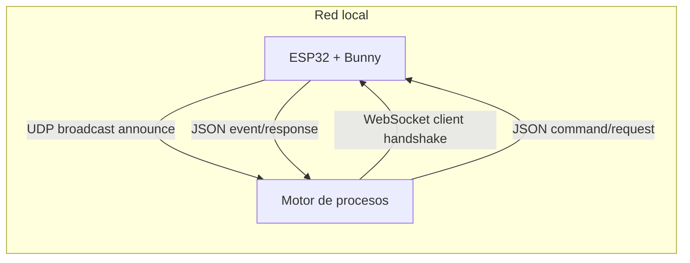
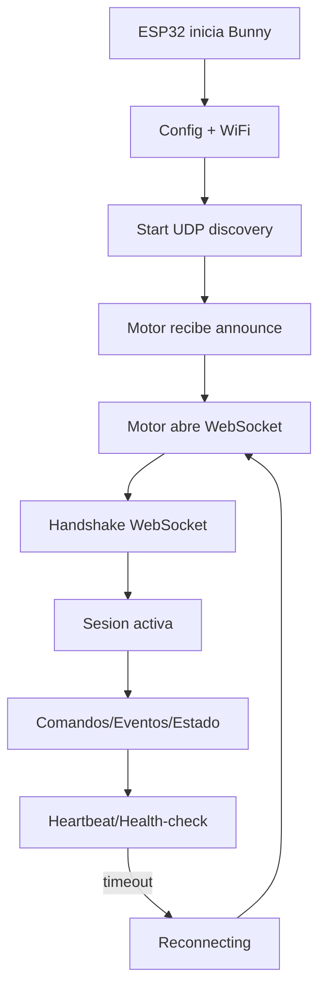
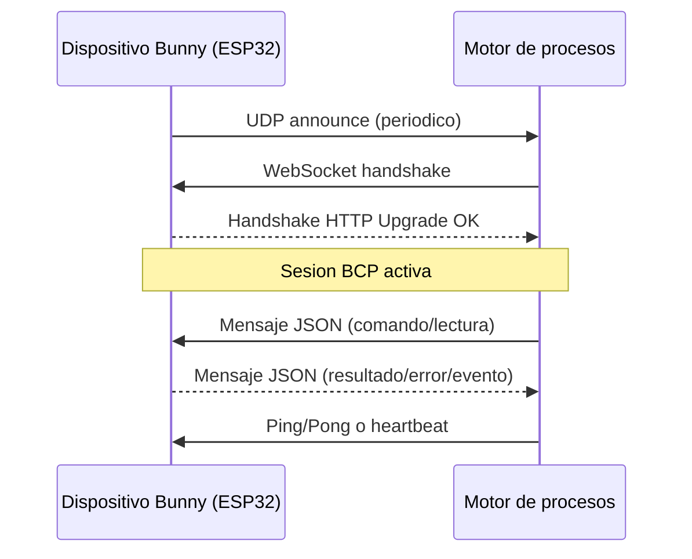
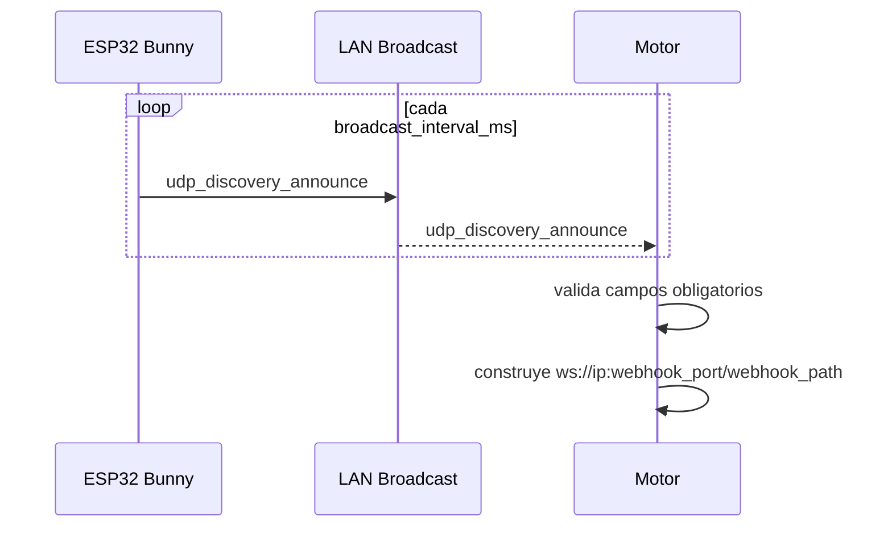
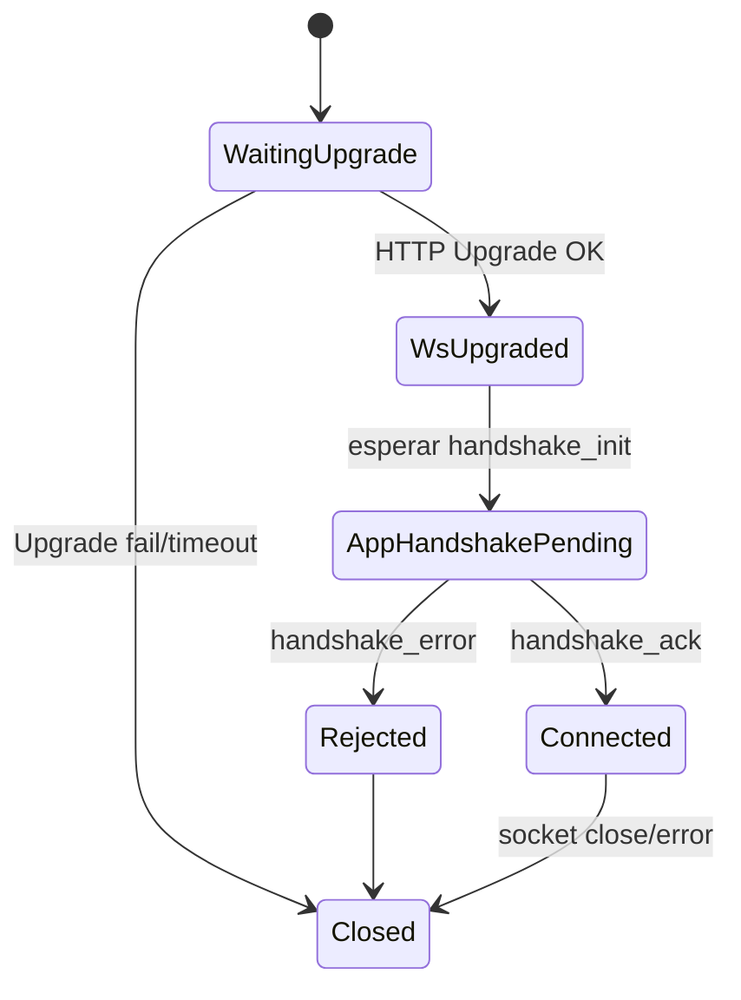
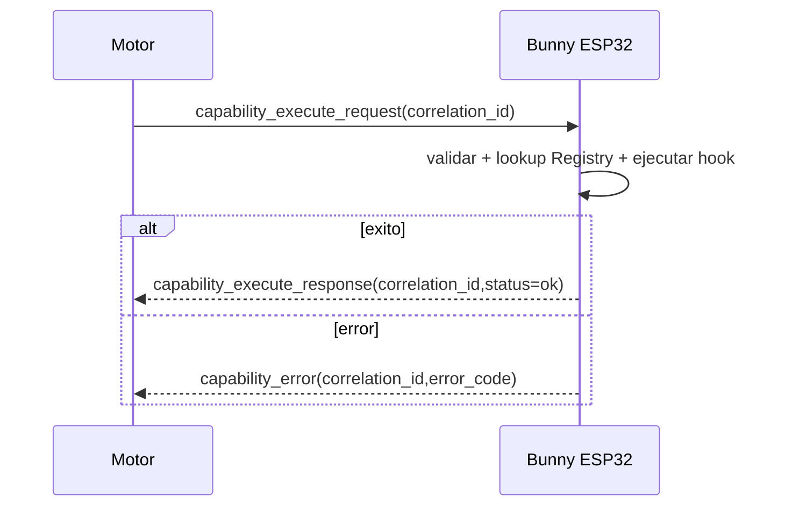
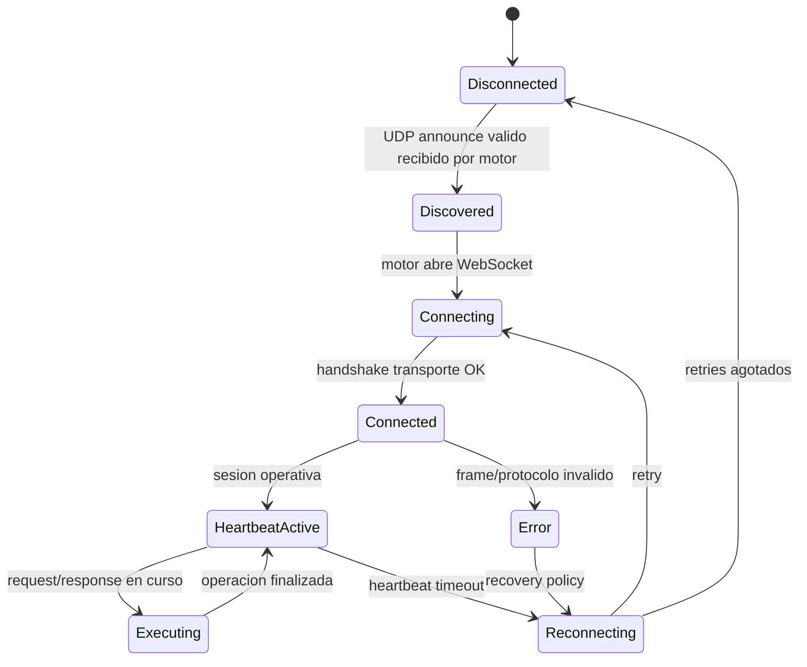

# BCP - Especificacion del Bunny Communication Protocol

Estado: Draft oficial del framework

Version del documento: 0.1.0

Fecha: 28 de abril de 2026

Alcance de implementacion auditado contra codigo fuente en `components/bunny` y `main`.

## Convenciones normativas

Las palabras clave MUST, SHOULD y MAY se interpretan como requisitos normativos:

- MUST: obligatorio para conformidad BCP.
- SHOULD: recomendado; puede omitirse con justificacion tecnica.
- MAY: opcional.

Cuando un requisito no esta implementado en el framework actual, se marca como:

- [NO IMPLEMENTADO]
- [PENDIENTE DE DEFINIR]

## 1. Introduccion

### 1.1 Que es BCP

BCP (Bunny Communication Protocol) es el conjunto de protocolos de descubrimiento, establecimiento de sesion, mantenimiento de sesion y transporte de mensajes entre:

- Emisor/Receptor A: microcontrolador con Bunny Framework (ESP32).
- Emisor/Receptor B: motor de procesos.

BCP define contrato de interoperabilidad, no logica de negocio.

### 1.2 Alcance

BCP cubre cinco capas:

- Discovery Layer.
- Connection Layer.
- Persistence Layer.
- Capability Execution Layer.
- Event Transport Layer.

BCP no cubre:

- Reglas de negocio del motor.
- Modelo interno de procesos del motor.
- Politicas de autenticacion/autorizacion externas al canal (salvo marcarlas como pendientes en esta version).

### 1.3 Objetivos

- Interoperabilidad: un motor tercero debe poder descubrir y conectar dispositivos Bunny.
- Extensibilidad: agregar tipos de mensajes sin romper clientes existentes.
- Tolerancia a fallos: detectar perdida de sesion y reconectar.
- Compatibilidad entre motores: mantener contrato comun con versionado explicito.

### 1.4 Invariantes globales BCP

- Un motor MUST completar handshake de conexion antes de enviar mensajes de ejecucion de capacidades.
- Todo mensaje de ejecucion MUST incluir `correlation_id`. [NO IMPLEMENTADO EN PARSEO DE DISPOSITIVO]
- Si el heartbeat vence, el estado de sesion MUST transicionar a `Reconnecting`. [NO IMPLEMENTADO EN MAQUINA DE ESTADOS DE CODIGO]
- El anuncio UDP MUST incluir endpoint WebSocket (`ip`, `webhook_port`, `webhook_path`) para habilitar conexion.
- El ESP32 MUST aceptar frames WebSocket de texto en el path configurado.

## 2. Arquitectura General

### 2.1 Componentes

- Bunny Framework (ESP32): emite discovery UDP, expone servidor WebSocket, registra capacidades.
- Motor de procesos: escucha UDP, construye URL WebSocket, inicia handshake y sesion.
- WebSocket transport: canal bidireccional de texto JSON.
- UDP discovery: anuncio periodico sin estado para presencia de dispositivo.

### 2.2 Diagrama de arquitectura



### 2.3 Diagrama de flujo general



### 2.4 Sequence diagram general



## 3. Protocolo de Descubrimiento por UDP Broadcast

Estado de implementacion: Implementado en emision del lado ESP32.

Fuente principal:

- `components/bunny/network/discovery.c`
- `components/bunny/network/discovery.h`
- `components/bunny/config/config.h`

### 3.1 Proposito

Permitir que el motor de procesos detecte dispositivos Bunny sin configuracion manual de IP.

### 3.2 Precondiciones

- El ESP32 MUST tener configuracion cargada (`bunny_config_get`).
- `discovery.enabled` MUST ser `true` para emitir anuncios.
- El socket UDP MUST crearse con `SO_BROADCAST` habilitado.

### 3.3 Flujo paso a paso

1. ESP32 inicia tarea `discovery_task`.
2. ESP32 resuelve IP local (si falla usa `0.0.0.0`).
3. ESP32 construye payload JSON de anuncio.
4. ESP32 envia UDP broadcast a `255.255.255.255:discovery.udp_port`.
5. ESP32 espera `broadcast_interval_ms`.
6. Repite mientras `s_started == true`.

### 3.4 Formato exacto del mensaje

Mensaje: `udp_discovery_announce`

Direccion: ESP32 -> Broadcast LAN

Transporte: UDP

Ejemplo de estructura wire:

```json
{
  "bunny": true,
  "id": "esp32-001",
  "name": "Mi Dispositivo Bunny",
  "version": "0.1.0",
  "ip": "192.168.1.50",
  "webhook_port": 8080,
  "webhook_path": "/bunny"
}
```

### 3.5 Campos obligatorios y opcionales

| Campo | Tipo | Requerido | Restricciones | Descripcion |
|---|---|---|---|---|
| bunny | boolean | Si | MUST ser `true` | Identificador de protocolo Bunny |
| id | string | Si | longitud > 0 | Identificador unico de dispositivo |
| name | string | Si | longitud > 0 | Nombre legible |
| version | string | Si | longitud > 0 | Version firmware/proyecto |
| ip | string | Si | IPv4 textual | IP reportada por ESP32 |
| webhook_port | integer | Si | 1..65535 | Puerto WebSocket del ESP32 |
| webhook_path | string | Si | MUST iniciar con `/` | Path de endpoint WebSocket |

### 3.6 Restricciones por campo

- `bunny` MUST ser booleano literal.
- `webhook_port` MUST ser entero decimal sin comillas.
- `webhook_path` SHOULD evitar espacios.
- `ip` MAY ser `0.0.0.0` si el ESP32 no obtuvo IP aun.

### 3.7 Validaciones

Validaciones implementadas por ESP32 al emitir:

- NO valida semantica de longitud ni formato de `id`, `name`, `version`, `webhook_path`; usa valores de configuracion.

Validaciones requeridas para motor receptor:

- MUST descartar anuncio si `bunny != true`.
- MUST descartar anuncio si falta `ip`, `webhook_port` o `webhook_path`.
- MUST validar rango de `webhook_port`.

### 3.8 Respuesta exitosa

UDP announce no tiene ACK de protocolo BCP.

Efecto esperado en motor:

- Motor MUST marcar el dispositivo como `Discovered` y construir URL WebSocket.

### 3.9 Respuestas de error

No existe mensaje de error en UDP discovery.

Errores observables en emisor ESP32:

- `Failed to create UDP socket`
- `Failed to enable UDP broadcast`
- `Failed building UDP payload`
- `UDP announce send failed`

### 3.10 Casos limite

- `ip = 0.0.0.0`: motor SHOULD posponer conexion hasta recibir IP valida.
- anuncios duplicados: motor MUST tratarlos como refresh de `last_seen`.
- reinicio de ESP32 con mismo `id`: motor MUST actualizar endpoint por ultimo anuncio.

### 3.11 Timeouts

- Intervalo de emision actual: `discovery.broadcast_interval_ms` (default 3000 ms).
- Timeout de stale en motor: [PENDIENTE DE DEFINIR].

### 3.12 Reintentos

- Emisor ESP32 reintenta automaticamente por diseño de bucle periodico.
- Politica de reintento de parseo/descubrimiento en motor: [PENDIENTE DE DEFINIR].

### 3.13 Reconexion

- El motor SHOULD usar anuncio actualizado para reconectar WebSocket si cambia IP/puerto/path.

### 3.14 Seguridad

- Discovery UDP no incluye autenticacion ni firma de mensaje. [NO IMPLEMENTADO]
- Integridad del anuncio: [PENDIENTE DE DEFINIR].

### 3.15 Estado de implementacion

- Emision UDP periodica: Implementado.
- Recepcion/validacion formal en motor: fuera de este repositorio.
- Integridad/autenticidad de anuncio: [NO IMPLEMENTADO].

#### JSON Schema: `udp_discovery_announce`

```json
{
  "$schema": "https://json-schema.org/draft/2020-12/schema",
  "$id": "bcp://schemas/udp_discovery_announce.json",
  "type": "object",
  "additionalProperties": false,
  "required": [
    "bunny",
    "id",
    "name",
    "version",
    "ip",
    "webhook_port",
    "webhook_path"
  ],
  "properties": {
    "bunny": { "const": true },
    "id": { "type": "string", "minLength": 1 },
    "name": { "type": "string", "minLength": 1 },
    "version": { "type": "string", "minLength": 1 },
    "ip": {
      "type": "string",
      "pattern": "^(?:[0-9]{1,3}\\.){3}[0-9]{1,3}$"
    },
    "webhook_port": { "type": "integer", "minimum": 1, "maximum": 65535 },
    "webhook_path": { "type": "string", "pattern": "^/.+" }
  }
}
```

Ejemplo valido:

```json
{
  "bunny": true,
  "id": "esp32-001",
  "name": "Nodo sala",
  "version": "0.1.0",
  "ip": "192.168.1.50",
  "webhook_port": 8080,
  "webhook_path": "/bunny"
}
```

Ejemplo invalido:

```json
{
  "bunny": "true",
  "id": "",
  "name": "Nodo sala",
  "version": "0.1.0",
  "ip": "not-an-ip",
  "webhook_port": "8080",
  "webhook_path": "bunny"
}
```

Explicacion semantica:

- Mensaje valido indica presencia de dispositivo y endpoint de sesion.
- Mensaje invalido debe ser descartado por el motor para evitar conexiones a endpoints ambiguos.

### 3.16 Sequence diagram



## 4. Handshake de Conexion WebSocket

Estado de implementacion: Parcial.

- Handshake RFC6455 de transporte: Implementado (HTTP Upgrade en ESP32).
- Handshake BCP de aplicacion (JSON inicial): [NO IMPLEMENTADO].

Fuentes:

- `components/bunny/network/network.c`
- `components/bunny/network/network.h`

### 4.1 Proposito

Establecer una sesion WebSocket valida entre motor (cliente) y ESP32 (servidor).

### 4.2 Precondiciones

- Motor MUST haber obtenido endpoint por discovery o configuracion equivalente.
- Motor MUST usar cliente WebSocket RFC6455 (frames enmascarados).
- ESP32 MUST estar escuchando en `webhook.port` y `webhook.path`.

### 4.3 Flujo paso a paso

1. Motor envia HTTP Upgrade WebSocket a `webhook_path`.
2. ESP32 acepta handshake de transporte.
3. ESP32 marca `s_ws_connected = true`.
4. Sesion queda activa para frames de texto.
5. Handshake BCP de aplicacion: [NO IMPLEMENTADO].

### 4.4 Formato exacto del mensaje

#### 4.4.1 Handshake de transporte (actual)

No es JSON BCP; es handshake WebSocket estandar HTTP Upgrade.

#### 4.4.2 Handshake BCP de aplicacion (normativo)

Mensaje: `bcp_handshake_init`

Direccion: Motor -> ESP32

```json
{
  "type": "handshake_init",
  "engine_id": "engine-main-01",
  "protocol_version": "0.1.0",
  "capabilities": {
    "supports_async": true,
    "supports_ack": true
  }
}
```

Estado: [NO IMPLEMENTADO]

### 4.5 Campos obligatorios y opcionales

Campos minimos exigidos por BCP:

- `engine_id` MUST estar presente.
- `protocol_version` MUST estar presente.
- `capabilities` MUST estar presente.

### 4.6 Restricciones por campo

- `engine_id`: string no vacio.
- `protocol_version`: string semver-like. [PENDIENTE DE DEFINIR VALIDACION EXACTA]
- `capabilities`: objeto JSON.

### 4.7 Validaciones

Validaciones actuales en ESP32:

- valida framing WebSocket a nivel transporte.
- no valida schema de payload de handshake BCP. [NO IMPLEMENTADO]

Validaciones requeridas:

- MUST rechazar JSON malformado.
- MUST rechazar faltantes de `engine_id`, `protocol_version`, `capabilities`.
- MUST rechazar version incompatible.

### 4.8 Respuesta exitosa

Mensaje esperado: `bcp_handshake_ack` [NO IMPLEMENTADO]

```json
{
  "type": "handshake_ack",
  "status": "ok",
  "device_id": "esp32-001",
  "protocol_version": "0.1.0"
}
```

### 4.9 Respuestas de error

Errores requeridos:

- malformed json
- missing fields
- invalid capability
- protocol mismatch

Estado actual:

- No hay respuesta JSON de error de aplicacion; solo errores de lectura WebSocket/logs.

Mensaje normativo propuesto: `bcp_handshake_error` [NO IMPLEMENTADO]

```json
{
  "type": "handshake_error",
  "error_code": "PROTOCOL_MISMATCH",
  "message": "unsupported protocol_version"
}
```

### 4.10 Casos limite

- cliente abre TCP pero no completa upgrade: MUST no marcar conectado.
- cliente envia frames no enmascarados: MUST cerrar/rechazar segun libreria.
- doble handshake de aplicacion en misma sesion: [PENDIENTE DE DEFINIR].

### 4.11 Timeouts

- Timeout de handshake transporte: definido por stack/libreria cliente-servidor.
- Timeout de handshake BCP JSON: [PENDIENTE DE DEFINIR].

### 4.12 Reintentos

- Motor SHOULD aplicar backoff progresivo al reconectar (1s, 2s, 5s, 10s, 30s recomendado).

### 4.13 Reconexion

- Si sesion se cae, motor MUST reabrir WebSocket.
- Si cambia endpoint para mismo `device.id`, motor MUST cerrar socket anterior y abrir nuevo.

### 4.14 Seguridad

- Autenticacion de motor: [NO IMPLEMENTADO].
- Autorizacion por `engine_id`: [NO IMPLEMENTADO].
- TLS (`wss://`): [PENDIENTE DE DEFINIR].

### 4.15 Estado de implementacion

- Transporte WebSocket: Implementado.
- Handshake BCP JSON: Planeado.
- Catalogo de errores de handshake JSON: Planeado.

#### JSON Schema: `bcp_handshake_init` (normativo)

```json
{
  "$schema": "https://json-schema.org/draft/2020-12/schema",
  "$id": "bcp://schemas/bcp_handshake_init.json",
  "type": "object",
  "additionalProperties": false,
  "required": ["type", "engine_id", "protocol_version", "capabilities"],
  "properties": {
    "type": { "const": "handshake_init" },
    "engine_id": { "type": "string", "minLength": 1 },
    "protocol_version": { "type": "string", "minLength": 1 },
    "capabilities": { "type": "object" }
  }
}
```

Solicitud valida:

```json
{
  "type": "handshake_init",
  "engine_id": "engine-main-01",
  "protocol_version": "0.1.0",
  "capabilities": {
    "supports_async": true,
    "supports_ack": true
  }
}
```

Solicitud invalida:

```json
{
  "type": "handshake_init",
  "engine_id": "",
  "protocol_version": 1,
  "capabilities": []
}
```

Explicacion semantica:

- Este mensaje declara identidad del motor y version de protocolo que pretende usar.
- Sin este intercambio, el dispositivo no puede negociar capacidades de sesion de forma determinista.

### 4.16 State machine (handshake)



## 5. Protocolo de Persistencia (Heartbeat)

Estado de implementacion: Parcial.

- Heartbeat de log local cada 5 segundos: Implementado.
- Heartbeat de protocolo JSON ping/pong: [NO IMPLEMENTADO].
- Politica de timeout y reconexion en dispositivo: [NO IMPLEMENTADO].

Fuentes:

- `components/bunny/bunny_sdk.cpp`
- `components/bunny/network/network.c`

### 5.1 Proposito

Detectar sesiones degradadas y disparar reconexion controlada.

### 5.2 Precondiciones

- Sesion WebSocket abierta.

### 5.3 Flujo paso a paso

1. Motor envia `heartbeat_ping` o ping de libreria WebSocket.
2. ESP32 responde `heartbeat_pong` o pong de stack.
3. Motor evalua timeout.
4. Si vence timeout, motor cierra sesion y reconecta.

Pasos 1-2 en JSON BCP: [NO IMPLEMENTADO].

### 5.4 Formato exacto del mensaje

Mensaje normativo: `heartbeat_ping` [NO IMPLEMENTADO]

```json
{
  "type": "heartbeat_ping",
  "correlation_id": "hb-0001",
  "ts": "2026-04-28T12:00:00Z"
}
```

Respuesta normativa: `heartbeat_pong` [NO IMPLEMENTADO]

```json
{
  "type": "heartbeat_pong",
  "correlation_id": "hb-0001",
  "ts": "2026-04-28T12:00:00Z"
}
```

### 5.5 Campos obligatorios y opcionales

- `type` MUST estar presente.
- `correlation_id` MUST estar presente.
- `ts` SHOULD estar presente.

### 5.6 Restricciones por campo

- `correlation_id` MUST ser unico por ping pendiente.
- `ts` SHOULD ser ISO-8601 UTC.

### 5.7 Validaciones

- Validacion de schema heartbeat en ESP32: [NO IMPLEMENTADO].

### 5.8 Respuesta exitosa

- `heartbeat_pong` correlacionado.
- En modo actual, exito observado indirectamente por socket vivo y/o pong de libreria cliente.

### 5.9 Respuestas de error

- Mensaje JSON `heartbeat_error`: [NO IMPLEMENTADO].
- En practica actual, error se refleja como cierre de socket o timeout de cliente.

### 5.10 Casos limite

- pings concurrentes con mismo `correlation_id`: MUST tratarse como error de protocolo. [NO IMPLEMENTADO]
- pong tardio tras timeout: motor MUST ignorarlo.

### 5.11 Timeouts

- Intervalo heartbeat JSON: [PENDIENTE DE DEFINIR].
- Timeout heartbeat JSON: [PENDIENTE DE DEFINIR].
- Heartbeat local de monitor ESP32: 5000 ms (solo log interno).

### 5.12 Reintentos

- Reintentos por mensaje heartbeat: [PENDIENTE DE DEFINIR].

### 5.13 Reconexion

- Ante timeout, motor MUST pasar a `Reconnecting` y reabrir sesion.
- El dispositivo MAY continuar discovery UDP si sesion no esta activa.

### 5.14 Seguridad

- Heartbeat no incluye firma ni token. [NO IMPLEMENTADO]

### 5.15 Estado de implementacion

- Health logging local: Implementado.
- Ping/pong semantico BCP: Planeado.

#### JSON Schema: `heartbeat_ping` (normativo)

```json
{
  "$schema": "https://json-schema.org/draft/2020-12/schema",
  "$id": "bcp://schemas/heartbeat_ping.json",
  "type": "object",
  "additionalProperties": false,
  "required": ["type", "correlation_id"],
  "properties": {
    "type": { "const": "heartbeat_ping" },
    "correlation_id": { "type": "string", "minLength": 1 },
    "ts": { "type": "string", "format": "date-time" }
  }
}
```

Ejemplo valido:

```json
{
  "type": "heartbeat_ping",
  "correlation_id": "hb-100",
  "ts": "2026-04-28T12:00:00Z"
}
```

Ejemplo invalido:

```json
{
  "type": "heartbeat_ping",
  "correlation_id": "",
  "ts": 1714305600
}
```

Explicacion semantica:

- Sirve para comprobar liveness de sesion y latencia operativa.

## 6. Protocolo de Ejecucion de Capacidades

Estado de implementacion: [NO IMPLEMENTADO] en dispatcher de red/protocolo.

Evidencia:

- `components/bunny/protocol/protocol.c` -> TODO.
- `components/bunny/runtime/runtime.c` -> TODO.
- `components/bunny/bunny_sdk.cpp` emite comentario TODO para envio de eventos.

### 6.1 Proposito

Permitir que el motor invoque capacidades declaradas por el dispositivo y reciba respuesta correlacionada.

### 6.2 Precondiciones

- Handshake WebSocket completado.
- Capacidad objetivo registrada en `Registry`.

### 6.3 Flujo paso a paso

1. Motor envia solicitud `capability_execute_request`.
2. Dispositivo valida schema y existencia de capacidad.
3. Dispositivo ejecuta hook correspondiente (sensor/command/state).
4. Dispositivo responde con `capability_execute_response` o `capability_error`.

Pasos 2-4: [NO IMPLEMENTADO].

### 6.4 Formato exacto del mensaje

Mensaje normativo de solicitud:

```json
{
  "type": "capability_execute_request",
  "correlation_id": "req-001",
  "capability_kind": "command",
  "capability_name": "setFanState",
  "params": {
    "state": "ON"
  }
}
```

Mensaje normativo de respuesta exitosa:

```json
{
  "type": "capability_execute_response",
  "correlation_id": "req-001",
  "status": "ok",
  "result": {
    "ack": true
  }
}
```

Mensaje normativo de error:

```json
{
  "type": "capability_error",
  "correlation_id": "req-001",
  "error_code": "CAPABILITY_NOT_FOUND",
  "message": "setFanState not registered"
}
```

### 6.5 Campos obligatorios y opcionales

Solicitud MUST incluir:

- `type`
- `correlation_id`
- `capability_kind`
- `capability_name`

`params` MAY omitirse si la capacidad no recibe parametros.

### 6.6 Restricciones por campo

- `capability_kind` MUST ser uno de `sensor|command|event|state`.
- `capability_name` MUST coincidir exactamente con nombre registrado.
- `correlation_id` MUST ser unico por solicitud activa.

### 6.7 Validaciones

Validaciones requeridas:

- existencia de capacidad.
- tipo de capacidad compatible con operacion.
- parametros requeridos presentes y tipados.

Estado actual: [NO IMPLEMENTADO].

### 6.8 Respuesta exitosa

- `capability_execute_response` con `status=ok` y `correlation_id` original.

### 6.9 Respuestas de error

- `CAPABILITY_NOT_FOUND`
- `INVALID_KIND`
- `INVALID_PARAMS`
- `EXECUTION_FAILED`

Mapeo a codigo actual: [PENDIENTE DE DEFINIR] (no hay errores estructurados en wire).

### 6.10 Casos limite

- solicitud duplicada con mismo `correlation_id`: MUST ser idempotente o rechazada explicitamente. [PENDIENTE DE DEFINIR]
- respuesta tardia tras reconexion: motor MUST descartarla si correlation ya expiro.

### 6.11 Timeouts

- timeout de ejecucion por capacidad: [PENDIENTE DE DEFINIR].

### 6.12 Reintentos

- retries de comando SHOULD considerar idempotencia de capacidad.
- politicas por tipo de capacidad: [PENDIENTE DE DEFINIR].

### 6.13 Reconexion

- solicitudes en vuelo al caer socket MUST transicionar a estado error en motor.

### 6.14 Seguridad

- control de autorizacion por capacidad: [NO IMPLEMENTADO].

### 6.15 Estado de implementacion

- Registro de capacidades y metadata: Implementado.
- Transporte de ejecucion desde red hasta hook: Planeado.

### 6.16 Catalogo actual de capacidades de ejemplo

Formato requerido:

- Capacidad
- Descripcion
- Solicitud
- Respuesta
- Errores
- Notas

Capacidad: `setFanState` (command)

Descripcion: cambia estado de rele de ventilador.

Solicitud:

```json
{
  "type": "capability_execute_request",
  "correlation_id": "cmd-001",
  "capability_kind": "command",
  "capability_name": "setFanState",
  "params": { "state": "ON" }
}
```

Respuesta:

```json
{
  "type": "capability_execute_response",
  "correlation_id": "cmd-001",
  "status": "ok",
  "result": { "state": "ON" }
}
```

Errores:

- `INVALID_PARAMS` si falta `state`.
- `EXECUTION_FAILED` si hardware falla.

Notas:

- Dispatcher y respuesta JSON aun [NO IMPLEMENTADO].
- Hook local de comando si existe esta implementado en modulo de ejemplo.

Capacidad: `temperature` (sensor)

Descripcion: lectura de temperatura.

Solicitud:

```json
{
  "type": "capability_execute_request",
  "correlation_id": "sns-001",
  "capability_kind": "sensor",
  "capability_name": "temperature"
}
```

Respuesta:

```json
{
  "type": "capability_execute_response",
  "correlation_id": "sns-001",
  "status": "ok",
  "result": { "value": 23.5 }
}
```

Errores:

- `CAPABILITY_NOT_FOUND`
- `EXECUTION_FAILED`

Notas:

- Sensor local de ejemplo retorna valor fijo.
- Transporte wire aun [NO IMPLEMENTADO].

Capacidad: `fanState` (state)

Descripcion: lectura/escritura de estado de ventilador.

Solicitud:

```json
{
  "type": "capability_execute_request",
  "correlation_id": "st-001",
  "capability_kind": "state",
  "capability_name": "fanState",
  "params": { "op": "set", "value": "OFF" }
}
```

Respuesta:

```json
{
  "type": "capability_execute_response",
  "correlation_id": "st-001",
  "status": "ok",
  "result": { "value": "OFF" }
}
```

Errores:

- `INVALID_PARAMS`
- `EXECUTION_FAILED`

Notas:

- Semantica exacta de operaciones de estado [PENDIENTE DE DEFINIR].

Matriz de implementacion:

| Capacidad | Implementado | Parcial | Pendiente |
|---|---|---|---|
| `setFanState` | Hook local | Transporte wire | Dispatcher/errores estructurados |
| `temperature` | Hook local | Transporte wire | Dispatcher/errores estructurados |
| `motion_detected` | Declaracion + hook local | Emision wire | ACK/event ordering |
| `fanState` | Hook local get/set | Transporte wire | Operaciones state protocol |

### 6.17 JSON Schema: `capability_execute_request` (normativo)

```json
{
  "$schema": "https://json-schema.org/draft/2020-12/schema",
  "$id": "bcp://schemas/capability_execute_request.json",
  "type": "object",
  "additionalProperties": false,
  "required": ["type", "correlation_id", "capability_kind", "capability_name"],
  "properties": {
    "type": { "const": "capability_execute_request" },
    "correlation_id": { "type": "string", "minLength": 1 },
    "capability_kind": { "enum": ["sensor", "command", "event", "state"] },
    "capability_name": { "type": "string", "minLength": 1 },
    "params": { "type": "object" }
  }
}
```

Ejemplo valido:

```json
{
  "type": "capability_execute_request",
  "correlation_id": "req-777",
  "capability_kind": "command",
  "capability_name": "setFanState",
  "params": { "state": "ON" }
}
```

Ejemplo invalido:

```json
{
  "type": "capability_execute_request",
  "correlation_id": "",
  "capability_kind": "cmd",
  "capability_name": 123,
  "params": []
}
```

Explicacion semantica:

- El motor solicita una operacion concreta sobre una capacidad registrada.
- `correlation_id` permite mapear una respuesta asincronica al request original.

### 6.18 Sequence diagram



## 7. Protocolo de Reporte de Eventos

Estado de implementacion: [NO IMPLEMENTADO] para envio wire hacia motor.

Evidencia:

- `BunnySDK::emit` incluye TODO para envio de evento via modulo de red.

### 7.1 Proposito

Reportar al motor hechos observados en hardware sin polling continuo.

### 7.2 Precondiciones

- Evento declarado en Registry.
- Sesion WebSocket activa.

### 7.3 Flujo paso a paso

1. Firmware invoca `Bunny.emit(event_name)`.
2. Dispositivo localiza capacidad tipo event.
3. Dispositivo serializa `event_report`.
4. Dispositivo envia frame JSON al motor.
5. Motor responde ACK opcional.

Pasos 3-5: [NO IMPLEMENTADO].

### 7.4 Formato exacto del mensaje

Mensaje normativo: `event_report`

```json
{
  "type": "event_report",
  "event_name": "motion_detected",
  "correlation_id": "evt-1001",
  "ts": "2026-04-28T12:00:00Z",
  "payload": {
    "zone": "living_room"
  }
}
```

ACK normativo opcional: `event_ack` [PENDIENTE DE DEFINIR]

```json
{
  "type": "event_ack",
  "correlation_id": "evt-1001",
  "status": "ok"
}
```

### 7.5 Campos obligatorios y opcionales

- `type` MUST estar presente.
- `event_name` MUST estar presente.
- `correlation_id` MUST estar presente.
- `payload` MAY estar vacio.

### 7.6 Restricciones por campo

- `event_name` MUST existir en Registry como `event`.
- `payload` SHOULD cumplir metadata de parametros del evento cuando existan.

### 7.7 Validaciones

- Validacion de evento registrado en emisor: Implementado (busqueda por nombre + kind).
- Validacion schema y envio wire: [NO IMPLEMENTADO].

### 7.8 Respuesta exitosa

- `event_ack` MAY usarse para confirmar recepcion. [PENDIENTE DE DEFINIR]

### 7.9 Respuestas de error

- `event_error` [NO IMPLEMENTADO].
- actualmente no hay canal de error estructurado para eventos.

### 7.10 Casos limite

- eventos fuera de secuencia: manejo en motor [PENDIENTE DE DEFINIR].
- duplicados tras reconexion: motor SHOULD deduplicar por `correlation_id`.

### 7.11 Timeouts

- timeout de ACK de evento: [PENDIENTE DE DEFINIR].

### 7.12 Reintentos

- politica de retry de evento: [PENDIENTE DE DEFINIR].

### 7.13 Reconexion

- eventos en vuelo al perder socket: [PENDIENTE DE DEFINIR].

### 7.14 Seguridad

- integridad/autenticidad de evento: [NO IMPLEMENTADO].

### 7.15 Estado de implementacion

- Declaracion de eventos: Implementado.
- Hook local on_emit: Implementado.
- Transporte de evento a motor: Planeado.

#### JSON Schema: `event_report` (normativo)

```json
{
  "$schema": "https://json-schema.org/draft/2020-12/schema",
  "$id": "bcp://schemas/event_report.json",
  "type": "object",
  "additionalProperties": false,
  "required": ["type", "event_name", "correlation_id"],
  "properties": {
    "type": { "const": "event_report" },
    "event_name": { "type": "string", "minLength": 1 },
    "correlation_id": { "type": "string", "minLength": 1 },
    "ts": { "type": "string", "format": "date-time" },
    "payload": { "type": "object" }
  }
}
```

Ejemplo valido:

```json
{
  "type": "event_report",
  "event_name": "motion_detected",
  "correlation_id": "evt-555",
  "ts": "2026-04-28T12:00:00Z",
  "payload": {
    "zone": "garage"
  }
}
```

Ejemplo invalido:

```json
{
  "type": "event_report",
  "event_name": "",
  "correlation_id": 555,
  "payload": []
}
```

Explicacion semantica:

- `event_report` notifica un hecho ocurrido en el dispositivo.
- El motor usa `correlation_id` para trazabilidad y deduplicacion.

## 8. Reglas de Validacion JSON

### 8.1 Que valida Bunny hoy

Nivel actual:

- WebSocket framing basico (stack ESP-IDF).
- Recepcion de frames y logging textual del payload.

### 8.2 Que no valida aun

- Schema JSON por tipo de mensaje.
- tipos de campos de protocolo.
- presencia de campos obligatorios de handshake/exec/event.
- correlation_id unico.

Todo lo anterior: [NO IMPLEMENTADO].

### 8.3 Errores de armado y parseo

Errores observables actuales:

- `WebSocket read length failed: <esp_err>`
- `WebSocket read failed: <esp_err>`

No existe catalogo de parse errors BCP con codigo wire: [NO IMPLEMENTADO].

### 8.4 Brechas conocidas de validacion

- Se acepta frame texto sin tipar semantica.
- No hay rechazo formal de payload malformado a nivel BCP.
- No hay respuesta de error JSON estandar.

### 8.5 Ejemplos malformed payload

Malformed 1:

```json
{"type": "capability_execute_request", "capability_kind": "command"}
```

Problema: falta `correlation_id` y `capability_name`.

Malformed 2:

```json
{"type": "handshake_init", "engine_id": 99}
```

Problema: `engine_id` no es string y faltan campos obligatorios.

Malformed 3:

```json
{"type":"event_report","event_name":"motion_detected","payload":"bad"}
```

Problema: `payload` deberia ser objeto JSON.

## 9. Maquina de Estados de BCP



Transiciones observadas en codigo actual:

- `Disconnected -> Connected` (visto por `s_ws_connected=true` tras handshake/frame).
- `Connected -> Disconnected/Error` parcial por fallos de lectura.
- estados intermedios (`Discovered`, `Reconnecting`, `Executing`) no estan materializados como enum de runtime. [NO IMPLEMENTADO]

Invariantes:

- `Executing` MUST requerir `Connected`.
- `HeartbeatActive` MUST requerir socket abierto.
- `Reconnecting` MUST cancelar solicitudes en vuelo o marcarlas expiradas.

## 10. Versionado del Protocolo

### 10.1 Regla de versionado

BCP MUST usar versionado semantico `major.minor.patch` en `protocol_version`.

### 10.2 Compatibilidad backward

- Diferente `major` MUST considerarse incompatible por defecto.
- Diferente `minor` SHOULD permitir compatibilidad hacia atras si mensajes requeridos no cambian.
- Diferente `patch` MUST ser compatible.

### 10.3 Adaptacion de motores personalizados

- Motor MUST anunciar `protocol_version` en handshake_init.
- Motor MAY anunciar lista de features opcionales en `capabilities`.

Estado actual en codigo:

- Negociacion de version en runtime: [NO IMPLEMENTADO].

## 11. Cobertura e Implementaciones Faltantes

| Protocolo | Estado | Codigo fuente relacionado | Notas |
|---|---|---|---|
| Discovery UDP broadcast | Implementado | `components/bunny/network/discovery.c`, `components/bunny/network/discovery.h` | Emision periodica real con payload JSON |
| Conexion WebSocket (transporte) | Implementado | `components/bunny/network/network.c`, `components/bunny/network/network.h` | Handshake RFC6455 y recepcion de frames |
| Handshake BCP JSON | Planeado | `components/bunny/protocol/protocol.c`, `components/bunny/protocol/protocol.h` | Archivo existe, logica TODO |
| Heartbeat de protocolo JSON | Planeado | `components/bunny/runtime/runtime.c`, `components/bunny/runtime/runtime.h` | Runtime TODO; heartbeat actual es log local |
| Ejecucion de capacidades por mensajes | Planeado | `components/bunny/protocol/protocol.c`, `components/bunny/runtime/runtime.c`, `components/bunny/registry/registry.cpp` | Registry y hooks listos; falta dispatcher wire |
| Reporte de eventos al motor | Planeado | `components/bunny/bunny_sdk.cpp` | `BunnySDK::emit` tiene TODO de envio en red |
| Validacion JSON por schema | Planeado | `components/bunny/protocol/protocol.c` | No hay parser/validator activo |

## 12. Apendices

### 12.1 Catalogo de codigos de error

Catalogo wire actual:

- [NO IMPLEMENTADO]

Catalogo normativo propuesto:

| Error Code | Tipo | Significado |
|---|---|---|
| MALFORMED_JSON | handshake/exec/event | JSON no parseable |
| MISSING_FIELDS | handshake/exec/event | faltan campos obligatorios |
| PROTOCOL_MISMATCH | handshake | version no compatible |
| INVALID_CAPABILITY | exec | capacidad inexistente o invalida |
| INVALID_PARAMS | exec | parametros invalidos |
| EXECUTION_FAILED | exec | fallo interno de ejecucion |
| HEARTBEAT_TIMEOUT | heartbeat | sesion expirada |

Estado: [PENDIENTE DE DEFINIR EN IMPLEMENTACION].

### 12.2 Catalogo de tipos de mensajes

| Message Type | Direccion | Estado |
|---|---|---|
| udp_discovery_announce | ESP32 -> Broadcast | Implementado |
| handshake_init | Motor -> ESP32 | Planeado |
| handshake_ack | ESP32 -> Motor | Planeado |
| handshake_error | ESP32 -> Motor | Planeado |
| heartbeat_ping | Motor -> ESP32 | Planeado |
| heartbeat_pong | ESP32 -> Motor | Planeado |
| capability_execute_request | Motor -> ESP32 | Planeado |
| capability_execute_response | ESP32 -> Motor | Planeado |
| capability_error | ESP32 -> Motor | Planeado |
| event_report | ESP32 -> Motor | Planeado |
| event_ack | Motor -> ESP32 | Planeado |

### 12.3 Glosario

- BCP: Bunny Communication Protocol.
- Motor de procesos: cliente que orquesta logica de negocio.
- Capability: contrato de hardware declarado por el firmware.
- Correlation ID: identificador de trazabilidad request/response.
- Discovery: deteccion de dispositivo por broadcast UDP.
- Session: conexion WebSocket activa entre motor y dispositivo.

### 12.4 Referencia rapida de payloads

`udp_discovery_announce` (implementado):

```json
{
  "bunny": true,
  "id": "esp32-001",
  "name": "Mi Dispositivo Bunny",
  "version": "0.1.0",
  "ip": "192.168.1.50",
  "webhook_port": 8080,
  "webhook_path": "/bunny"
}
```

`handshake_init` (planeado):

```json
{
  "type": "handshake_init",
  "engine_id": "engine-main-01",
  "protocol_version": "0.1.0",
  "capabilities": {"supports_async": true}
}
```

`capability_execute_request` (planeado):

```json
{
  "type": "capability_execute_request",
  "correlation_id": "req-001",
  "capability_kind": "command",
  "capability_name": "setFanState",
  "params": {"state": "ON"}
}
```

`event_report` (planeado):

```json
{
  "type": "event_report",
  "event_name": "motion_detected",
  "correlation_id": "evt-001",
  "payload": {"zone": "living_room"}
}
```

---

## Notas finales de conformidad

- Esta especificacion distingue explicitamente entre contrato BCP deseado y estado real de implementacion en el repositorio.
- Ningun comportamiento marcado como [NO IMPLEMENTADO] debe asumirse operativo en produccion hasta que exista codigo y pruebas que lo respalden.
