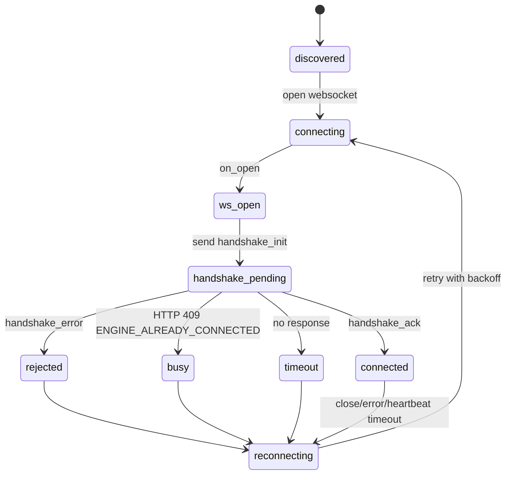

# Guía de Implementación de Handshake BCP para Motor de Procesos

Documento dirigido a implementadores del motor que necesitan establecer una sesión BCP robusta con un dispositivo ESP32 + Bunny.

Estado: vigente para la implementación actual del framework.

---

## 1. Objetivo del documento

Este documento define exactamente cómo debe implementar el motor el handshake BCP, incluyendo:

- orden de pasos obligatorio,
- payload exacto de solicitud,
- validaciones mínimas que debe hacer el motor,
- respuestas esperadas del ESP32,
- manejo de errores y reconexión,
- restricción de concurrencia (solo un motor activo por ESP32).

Este documento no describe lógica de negocio ni ejecución de capacidades.

---

## 2. Regla principal de conexión

Una sesión se considera activa únicamente cuando se cumplen ambos eventos:

1. Handshake de transporte WebSocket completado (`on_open` o equivalente de librería).
2. Respuesta `handshake_ack` recibida para el `handshake_init` enviado por el motor.

Si falta el punto 2, el motor MUST considerar la sesión como `connecting`, no `connected`.

---

## 3. Restricción de concurrencia (crítica)

El ESP32 permite un solo motor activo a la vez.

Comportamiento del servidor:

- Si no hay sesión activa, acepta la conexión WebSocket.
- Si ya hay otro motor conectado, rechaza el intento con `409 Conflict`.
- El rechazo incluye error semántico `ENGINE_ALREADY_CONNECTED`.

Comportamiento requerido del motor:

- MUST no abrir múltiples sockets simultáneos hacia el mismo `device.id`.
- MUST tratar `409 Conflict` como estado transitorio de concurrencia, no como bug permanente.
- SHOULD reintentar con backoff progresivo.

---

## 4. Flujo obligatorio de handshake

1. El motor descubre endpoint por UDP (`ip`, `webhook_port`, `webhook_path`) o usa configuración equivalente.
2. El motor abre WebSocket a `ws://<ip>:<webhook_port><webhook_path>`.
3. Cuando ocurre `on_open`, el motor envía inmediatamente `handshake_init`.
4. El motor espera respuesta de handshake dentro de timeout configurado.
5. Si recibe `handshake_ack`, cambia a estado `connected`.
6. Si recibe `handshake_error`, cierra socket y reintenta según política.
7. Si vence timeout sin respuesta, cierra socket y reintenta.

---

## 5. Solicitud que el motor MUST enviar

Tipo de mensaje: `handshake_init`

Dirección: Motor -> ESP32

```json
{
  "type": "handshake_init",
  "engine_id": "engine-main-01",
  "protocol_version": "0.1.0",
  "capabilities": {
    "supports_async": true,
    "supports_ack": true
  }
}
```

### 5.1 Campos obligatorios

- `type` MUST ser `handshake_init`.
- `engine_id` MUST ser string no vacío y estable para la instancia del motor.
- `protocol_version` MUST ser string y coincidir con la versión soportada por el dispositivo (actual: `0.1.0`).
- `capabilities` MUST existir y MUST ser objeto JSON.

### 5.2 Recomendaciones de implementación

- `engine_id` SHOULD incluir entorno o nodo para trazabilidad (ejemplo: `engine-prod-node-a`).
- `protocol_version` SHOULD centralizarse en una constante para evitar divergencia de código.
- El motor SHOULD loggear el payload enviado (sin secretos) para auditoría.

---

## 6. Respuestas que el motor debe manejar

### 6.1 Respuesta exitosa

Tipo de mensaje: `handshake_ack`

Dirección: ESP32 -> Motor

```json
{
  "type": "handshake_ack",
  "status": "ok",
  "device_id": "esp32-001",
  "protocol_version": "0.1.0"
}
```

Acción del motor:

- MUST marcar sesión `connected`.
- SHOULD validar que `protocol_version` coincide con la esperada.
- SHOULD guardar `device_id` recibido para trazabilidad cruzada con discovery.

### 6.2 Respuesta de error semántico

Tipo de mensaje: `handshake_error`

Dirección: ESP32 -> Motor

```json
{
  "type": "handshake_error",
  "error_code": "PROTOCOL_MISMATCH",
  "message": "unsupported protocol_version"
}
```

Acción del motor:

- MUST marcar sesión `error`.
- MUST cerrar socket.
- MUST registrar `error_code` + `message`.
- SHOULD decidir si reintentar según tipo de error.

### 6.3 Rechazo por concurrencia

Respuesta HTTP en upgrade: `409 Conflict`.

Error semántico esperado: `ENGINE_ALREADY_CONNECTED`.

Acción del motor:

- MUST no insistir en loop agresivo.
- SHOULD aplicar backoff.
- MAY informar estado `busy` del dispositivo en su inventario.

---

## 7. Máquina de estados recomendada del lado motor



---

## 8. Timeouts y reintentos mínimos

Configuración recomendada:

- `handshake_timeout_ms`: 3000 a 5000 ms.
- Backoff de reconexión: 1s, 2s, 5s, 10s, 30s (máximo).

Reglas:

- Si el timeout vence, el motor MUST cerrar el socket antes de reintentar.
- Cada reconexión MUST reenviar `handshake_init`.
- El motor MUST asumir handshake nuevo en cada socket nuevo.

---

## 9. Validaciones que el motor MUST hacer

Antes de enviar:

- Validar que `engine_id` no está vacío.
- Validar que `protocol_version` está definida.
- Validar que `capabilities` es objeto JSON.

Al recibir respuesta:

- Validar que el mensaje es JSON parseable.
- Validar campo `type`.
- Si `type=handshake_ack`, validar `status=ok`.
- Si `type=handshake_error`, capturar `error_code` y `message`.

---

## 10. Pseudocódigo de referencia

```text
on_device_discovered(device):
  url = build_ws_url(device)
  connect_ws(url)

on_ws_open(socket, device):
  send(socket, {
    type: "handshake_init",
    engine_id: ENGINE_ID,
    protocol_version: "0.1.0",
    capabilities: { supports_async: true, supports_ack: true }
  })
  start_timer(device.id, handshake_timeout_ms)

on_ws_message(socket, device, msg):
  parsed = parse_json(msg)
  if parsed.invalid:
    close(socket)
    schedule_retry(device)
    return

  if parsed.type == "handshake_ack" and parsed.status == "ok":
    cancel_timer(device.id)
    mark_connected(device)
    return

  if parsed.type == "handshake_error":
    cancel_timer(device.id)
    mark_error(device, parsed.error_code, parsed.message)
    close(socket)
    schedule_retry(device)
    return

on_handshake_timeout(device):
  close(device.socket)
  mark_error(device, "HANDSHAKE_TIMEOUT", "no handshake response")
  schedule_retry(device)
```

---

## 11. Lista de verificación de conformidad

Un motor se considera conforme al handshake BCP actual si:

- Envía `handshake_init` como primer mensaje de aplicación tras `on_open`.
- No marca `connected` antes de recibir `handshake_ack`.
- Maneja `handshake_error` de forma explícita.
- Maneja `409 Conflict`/`ENGINE_ALREADY_CONNECTED` con backoff.
- Mantiene un solo socket por `device.id`.
- Reenvía handshake en cada reconexión.

---

## 12. Referencias

- Especificación oficial: [BCP_SPECIFICATION.md](BCP_SPECIFICATION.md)
- Guía de sesión WebSocket: [PROCESS_ENGINE_WEBSOCKET_GUIDE.md](PROCESS_ENGINE_WEBSOCKET_GUIDE.md)
- Implementación del servidor: [../components/bunny/network/network.c](../components/bunny/network/network.c)
