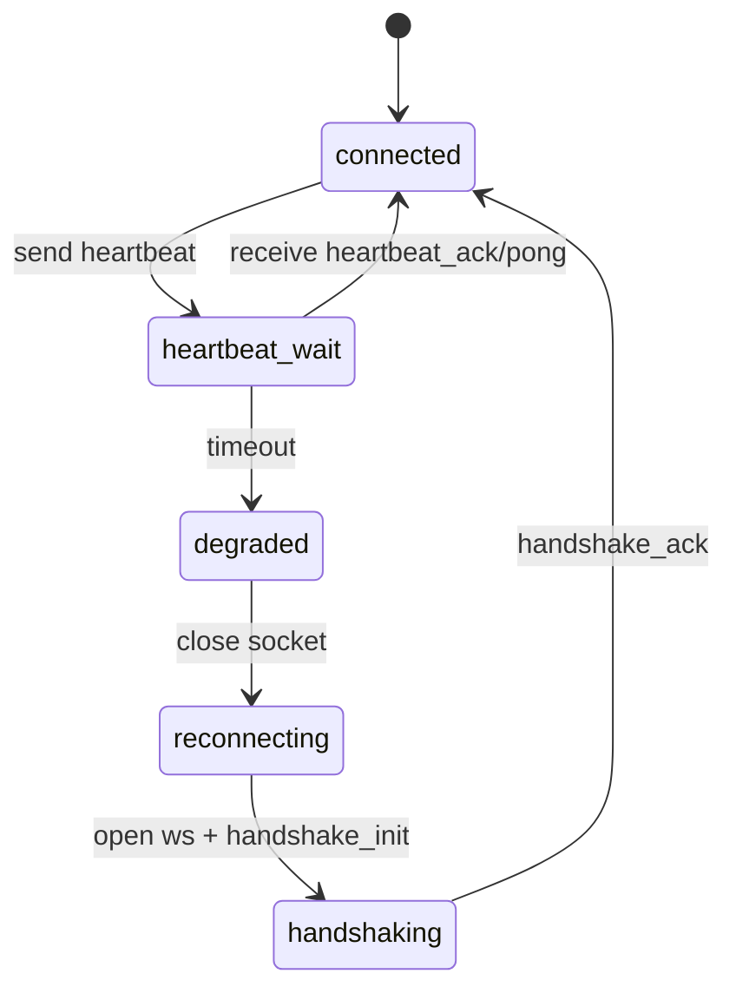

# Guía de Implementación de Heartbeat BCP para Motor de Procesos

Documento dirigido a implementadores del motor para mantener viva y verificable la sesión WebSocket después del handshake.

Estado: vigente para la implementación actual del framework.

---

## 1. Objetivo

Definir cómo el motor debe enviar heartbeat y cómo interpretar las respuestas del ESP32 para:

- detectar desconexión real en segundos,
- evitar sesiones "zombie" que parecen abiertas pero no operan,
- reconectar automáticamente sin intervención manual.

---

## 2. Relación con handshake

El flujo correcto es:

1. Handshake de transporte WebSocket (`on_open`).
2. Handshake de aplicación (`handshake_init` -> `handshake_ack`).
3. Heartbeat periódico durante toda la sesión.

Regla:

- El heartbeat NO reemplaza al handshake.
- El handshake habilita la sesión.
- El heartbeat mantiene y verifica esa sesión.

---

## 3. Mensajes de heartbeat soportados

### 3.1 Formato simple (compatibilidad)

Solicitud del motor:

```json
{
  "type": "heartbeat",
  "timestamp": "2026-04-28T21:36:45.354Z"
}
```

Respuesta del ESP32:

```json
{
  "type": "heartbeat_ack",
  "status": "ok",
  "timestamp": "2026-04-28T21:36:45.354Z"
}
```

### 3.2 Formato correlacionado (recomendado)

Solicitud del motor:

```json
{
  "type": "heartbeat_ping",
  "correlation_id": "hb-0001",
  "ts": "2026-04-28T21:36:45.354Z"
}
```

Respuesta del ESP32:

```json
{
  "type": "heartbeat_pong",
  "correlation_id": "hb-0001",
  "ts": "2026-04-28T21:36:45.354Z"
}
```

---

## 4. Reglas obligatorias del motor

- El motor MUST iniciar heartbeat solo después de `handshake_ack`.
- El motor MUST detener heartbeat cuando el socket se cierra.
- El motor MUST considerar fallo de sesión si no recibe `heartbeat_ack`/`heartbeat_pong` dentro del timeout.
- El motor MUST cerrar socket y reconectar tras timeout.
- El motor MUST reenviar `handshake_init` en cada reconexión antes de reanudar heartbeat.

---

## 5. Timeouts y frecuencia recomendada

Configuración sugerida:

- Intervalo de envío heartbeat: 5 segundos.
- Timeout por respuesta heartbeat: 10 segundos.
- Reintento de conexión: backoff 1s, 2s, 5s, 10s, 30s.

Criterio operativo:

- Si falla 1 heartbeat por pérdida puntual de red, el timeout total evita reconexión prematura.
- Si falla de forma sostenida, el timeout fuerza recuperación automática.

---

## 6. Máquina de estados recomendada



---

## 7. Pseudocódigo de referencia

```text
on_handshake_ack(device):
  device.connected = true
  start_periodic_heartbeat(device, every=5s)

send_heartbeat(device):
  msg = {
    type: "heartbeat_ping",
    correlation_id: next_hb_id(),
    ts: now_iso8601()
  }
  ws_send(device.socket, msg)
  track_pending_heartbeat(device, msg.correlation_id, sent_at=now_ms())

on_ws_message(device, msg):
  if msg.type == "heartbeat_pong":
    resolve_pending_heartbeat(device, msg.correlation_id)
    device.last_heartbeat_ok = now_ms()
    return

  if msg.type == "heartbeat_ack":
    device.last_heartbeat_ok = now_ms()
    return

heartbeat_watchdog_tick(device):
  if now_ms() - device.last_heartbeat_ok > 10000:
    close(device.socket)
    schedule_reconnect(device)
```

---

## 8. Errores frecuentes y mitigación

### Error: enviar heartbeat antes de handshake_ack

- Síntoma: sesión inestable o rechazo temprano.
- Mitigación: habilitar scheduler de heartbeat solo en estado `connected`.

### Error: no correlacionar heartbeat

- Síntoma: se confunden respuestas tardías con respuestas vigentes.
- Mitigación: usar `heartbeat_ping/pong` con `correlation_id`.

### Error: no cerrar socket tras timeout

- Síntoma: motor queda en falso estado `connected`.
- Mitigación: timeout MUST disparar cierre + reconexión.

---

## 9. Interacción con la regla de un solo motor por ESP32

Si un heartbeat falla y el motor reconecta tarde, otro motor podría estar activo.

Comportamiento esperado:

- El ESP32 rechaza segundo motor con `409 Conflict` y `ENGINE_ALREADY_CONNECTED`.
- El motor rechazado SHOULD quedar en backoff y reintentar luego.

---

## 10. Checklist de conformidad

- Heartbeat iniciado solo tras `handshake_ack`.
- Heartbeat detenido al cerrar socket.
- Timeout explícito configurado y monitoreado.
- Cierre + reconexión automática tras timeout.
- Reenvío de handshake en reconexión.
- Manejo de rechazo `409 Conflict`.

---

## 11. Referencias

- Handshake implementador: [HANDSHAKE_IMPLEMENTATION_GUIDE.md](HANDSHAKE_IMPLEMENTATION_GUIDE.md)
- Sesión WebSocket del motor: [PROCESS_ENGINE_WEBSOCKET_GUIDE.md](PROCESS_ENGINE_WEBSOCKET_GUIDE.md)
- Especificación BCP: [BCP_SPECIFICATION.md](BCP_SPECIFICATION.md)
- Implementación servidor: [../components/bunny/network/network.c](../components/bunny/network/network.c)
