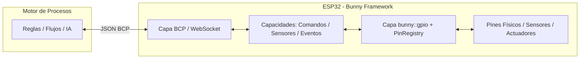

# Guía Completa de GPIOs en ESP32 y Ruta de Aprendizaje

Esta guía explica cómo **Bunny Framework** abstrae y gestiona los pines de propósito general (GPIO) en el ESP32, los conceptos fundamentales de hardware que necesitas dominar y una ruta de estudio paso a paso.

---

## 🐇 1. Concepto de Bunny Framework y Filosofía de Hardware

Bunny Framework sigue una arquitectura orientada a **capacidades declarativas** (*capabilities-first*):

1. **El firmware solo expone y controla hardware**: El ESP32 no toma decisiones complejas ni ejecuta lógica de negocio pesada.
2. **El motor de procesos decide el flujo**: Envía comandos JSON y recibe eventos/telemetría vía WebSocket usando el protocolo **BCP** (*Bunny Communication Protocol*).
3. **La capa `bunny::gpio` es el puente seguro**: Provee una API moderna, tipada y segura para interactuar con los pines físicos del ESP32 sin lidiar directamente con registros de bajo nivel de ESP-IDF.



---

## 🛠️ 2. ¿Qué maneja Bunny Framework con los GPIOs? (API Simplificada)

La implementación reside en `components/bunny/include/bunny_gpio.h` y `components/bunny/platform/esp32/bunny_gpio.cpp`. Gracias al header maestro `#include "bunny.h"`, todas estas funciones y constantes están disponibles directamente.

### A. Prevención de Conflictos de Hardware (`PinRegistry`)
Rastrea qué módulo reclama cada pin físico para evitar que dos partes del firmware intenten controlar el mismo pin.
```cpp
// Si el pin 15 ya fue reservado por otro módulo, pin_mode() devuelve false
// y emite un log de error explicativo.
pin_mode(15, OUTPUT, "rele_ventilador");
```

### B. E/S Digital Simple (Estilo Arduino / Zero-Config)
* **Constantes:** `INPUT`, `OUTPUT`, `INPUT_PULLUP`, `INPUT_PULLDOWN`, `PULLUP`, `PULLDOWN`, `HIGH`, `LOW`.
* **Funciones:**
  ```cpp
  pin_mode(15, OUTPUT);
  digital_write(15, HIGH); // Escribe 3.3V
  digital_write(15, LOW);  // Escribe 0V
  int val = digital_read(4); // Retorna 1 o 0
  ```

### C. Salida PWM Ultra-Simple (Auto-asignación de Canales LEDC)
* **Auto-gestión:** Ya no necesitas gestionar qué canal LEDC (0 a 7) asignar a cada pin. Bunny lo hace automáticamente.
* **Control por valor (0 a 255) o por porcentaje (0.0% a 100.0%):**
  ```cpp
  // 1. Estilo analogWrite (0 a 255)
  analog_write(18, 128); // 50% de potencia

  // 2. Control directo por porcentaje
  pwm_write_percent(18, 75.5); // 75.5% de potencia
  ```

### D. Lectura Analógica / ADC con Filtro de Ruido y Auto-Init
* **Zero-Config:** Si llamas a `analog_read(34)` en un pin ADC1 (GPIO 32 a 39), Bunny auto-inicializa el periférico ADC si no lo estaba.
* **Filtro de Ruido (Oversampling):** Promedia múltiples muestras rápidas para eliminar el ruido eléctrico del ESP32.
* **Formatos de lectura:**
  ```cpp
  int raw       = analog_read(34);                    // 0 .. 4095 (4 muestras promediadas)
  int raw_clean = analog_read(34, /*samples=*/16);    // 16 muestras promediadas
  double volts  = analog_read_voltage(34);            // 0.0 .. 3.3V
  double pct    = analog_read_percent(34);            // 0.0% .. 100.0%
  double temp_c = analog_read_mapped(34, 0.0, 80.0);  // Mapeo directo a rango 0 a 80 °C
  ```

### E. Interrupciones Asíncronas Seguras con Debounce
Permite reaccionar a pulsadores o sensores PIR instantáneamente sin bloquear el procesador:
* **Patrón de diseño:** `ISR (IRAM)` ➔ `FreeRTOS Queue` ➔ `Tarea Despachadora` ➔ `Callback C++`.
* **Anti-rebote por software integrado:** Filtra el ruido mecánico de pulsadores con el parámetro `debounce_ms`.
  ```cpp
  // Flanco de bajada con 50ms de filtro anti-rebote
  attach_interrupt(4, FALLING, []() {
      Bunny.emit("boton_presionado");
  }, 50);
  ```


---

## 📚 3. Mapa de Conceptos Clave que Necesitas Investigar

Para entender a fondo cómo funciona el hardware detrás de estas funciones, investiga estos temas organizados por capas:

### 1. Fundamentos Eléctricos
- [ ] **Nivel Lógico 3.3V vs 5V:** Conocer por qué el ESP32 no tolera 5V en sus pines y cómo usar divisores de tensión o *Logic Level Converters*.
- [ ] **Estado Flotante (*High-Z / Floating*):** Por qué una entrada sin conectar oscila entre 0 y 1 debido al ruido electromagnético.
- [ ] **Resistencias Pull-Up / Pull-Down:** Cómo garantizan un estado por defecto (`VCC` o `GND`).
- [ ] **Lógica Activa en Alto (*Active-High*) vs Activa en Bajo (*Active-Low*):** Identificar si un módulo se enciende con `1` o con `0`.

### 2. Entradas y Salidas Digitales
- [ ] **Límites de corriente (*Sink & Source*):** El ESP32 solo soporta ~20-40 mA por pin. Comprender por qué se usan transistores MOSFET o relés para cargas mayores.
- [ ] **Frecuencia de conmutación GPIO:** Velocidad máxima a la que un pin puede cambiar de estado.

### 3. Señales Graduales (PWM y ADC)
- [ ] **PWM (Pulse Width Modulation):**
  - **Frecuencia (Hz):** Ciclos por segundo de la onda cuadrada.
  - **Duty Cycle (%):** Proporción de tiempo en estado ALTO vs tiempo total.
  - **Resolución en bits:** Determina los pasos disponibles ($2^N$).
- [ ] **ADC (Analog-to-Digital Converter):**
  - **Resolución:** Relación entre voltaje y valor entero (12 bits = 4096 pasos).
  - **Atenuación:** Ajuste del rango de voltaje de entrada soportado.
  - **No linealidad del ESP32:** Conocer por qué las lecturas por debajo de 0.1V o por encima de 3.1V pierden precisión.

### 4. Tiempo Real y Eventos (Interrupciones)
- [ ] **Polling vs Interrupciones:** Diferencia entre preguntar constantemente en un bucle vs ser notificado por hardware.
- [ ] **Flancos (*Edges*):** `Rising` (0V $\to$ 3.3V), `Falling` (3.3V $\to$ 0V), `Any` (cambio).
- [ ] **Contexto de Interrupción (ISR):** Reglas críticas (no usar delays, no asignar memoria dinámica, ejecutar en microsegundos).
- [ ] **Rebote mecánico (*Switch Bounce*):** Qué ocurre físicamente en las láminas de un botón y cómo mitigarlo por software (*debounce*).

### 5. Pinout Especial del ESP32
- [ ] **Pines *Input-Only* (GPIO 34, 35, 36, 39):** No tienen pull-up/down interno ni pueden ser salidas.
- [ ] **Pines de *Strapping* (GPIO 0, 2, 5, 12, 15):** Pines que condicionan si el ESP32 entra en modo bootloader, flasheo o arranque normal.
- [ ] **Pines de Flash Interna (GPIO 6 a 11):** Pines prohibidos conectados a la memoria SPI interna.
- [ ] **Bloque ADC2 vs WiFi:** Por qué el periférico ADC2 se desactiva cuando el radio WiFi está transmitiendo.

---

## 🚀 4. Ruta de Aprendizaje Progresiva

Sigue esta secuencia para avanzar de forma sólida:

```text
┌────────────────────────────────────────────────────────┐
│ Semana 1: E/S Digital y Estados Lógicos                │
│ • Entender Pull-Up/Pull-Down                           │
│ • Controlar LEDs y relés con bunny::gpio::write()      │
│ • Leer pulsadores con bunny::gpio::read()              │
└───────────────────────────┬────────────────────────────┘
                            │
┌───────────────────────────▼────────────────────────────┐
│ Semana 2: Señales Graduales (PWM & ADC)                │
│ • Variar brillo/velocidad con bunny::gpio::pwm_*()     │
│ • Leer potenciómetros/LDR con bunny::gpio::adc_*()     │
│ • Exponer lecturas con BUNNY_SENSOR()                  │
└───────────────────────────┬────────────────────────────┘
                            │
┌───────────────────────────▼────────────────────────────┐
│ Semana 3: Eventos Asíncronos e Interrupciones          │
│ • Entender ISRs y Debounce                             │
│ • Usar bunny::gpio::attach_interrupt()                 │
│ • Conectar interrupciones a BUNNY_EVENT()              │
└───────────────────────────┬────────────────────────────┘
                            │
┌───────────────────────────▼────────────────────────────┐
│ Semana 4: Protocolos de Comunicación (I2C / SPI)       │
│ • Conectar pantallas TFT, sensores I2C (BME280, etc.)  │
│ • Encapsular hardware en drivers dentro de main/       │
└────────────────────────────────────────────────────────┘
```

---

## 💡 5. Ejemplo Práctico: Conectar Hardware a Capacidades Bunny

### Caso: Pulsador con Interrupción que emite un Evento
```cpp
// main/events/door_bell_event.cpp
#include "bunny.h"

static constexpr int BUTTON_PIN = 4;

BUNNY_EVENT(doorbellRung) {
    Bunny.event("doorbellRung")
         .description("Fired when someone presses the physical doorbell")
         .tag("security");

    // Configurar interrupción con 50ms de debounce
    bunny::gpio::attach_interrupt(BUTTON_PIN, bunny::gpio::Edge::FALLING, []() {
        Bunny.emit("doorbellRung");
    }, 50);
}
```

### Caso: Actuador de Relé controlado por Comando
```cpp
// main/commands/light_command.cpp
#include "bunny.h"

static constexpr int RELAY_PIN = 16;

BUNNY_COMMAND(setLight) {
    bunny::gpio::configure(RELAY_PIN, bunny::gpio::Mode::OUTPUT, "living_room_light");

    Bunny.command("setLight")
         .description("Turn room light ON or OFF")
         .param("state", STRING, "ON or OFF")
         .execute([](const bunny::Params& p) {
             const char* state = p.get_string("state");
             bunny::gpio::write(RELAY_PIN, strcmp(state, "ON") == 0 ? 1 : 0);
         });
}
```
